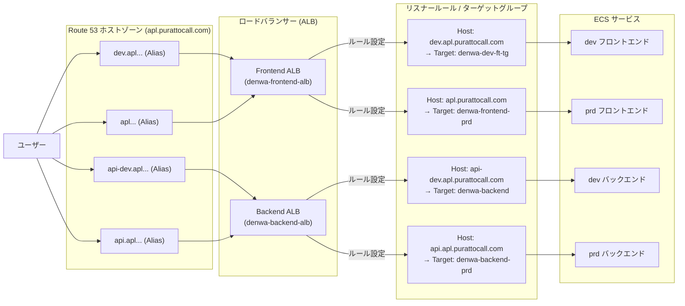
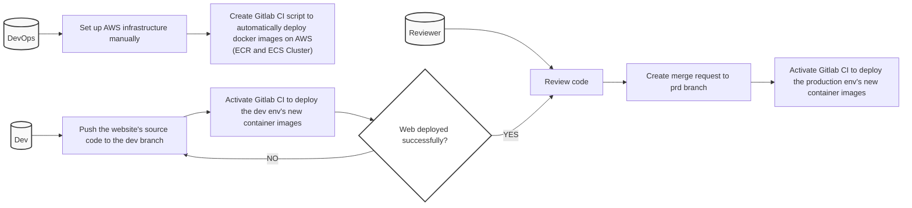

# インフラ構造設計書

第1.0.0版

2026年6月12日

## 改訂履歴

|            |       |                                                                                                                              |        |        |
| :--------- | :---- | :--------------------------------------------------------------------------------------------------------------------------- | :----- | :----- |
| 改訂日     | 版数  | 内容                                                                                                                         | 改訂者 | 承認者 |
| 2026/06/12 | 1.0.0 | VoIP電話システム開発プロジェクトの AWS インフラ構成図およびパラメータシートを、設計書フォーマットに合わせて整理。dev / prd 環境の構成を反映 | VTI    | -      |
|            |       |                                                                                                                              |        |        |

## 目次

- [1. イントロダクション](#1-イントロダクション)
  - [1.1 本書の位置づけ](#11-本書の位置づけ)
  - [1.2 前提事項](#12-前提事項)
  - [1.3 対象読者](#13-対象読者)
  - [1.4 関連ドキュメント](#14-関連ドキュメント)
- [2. 基本アーキテクチャ](#2-基本アーキテクチャ)
  - [2.1 基本方針](#21-基本方針)
  - [2.2 環境方針](#22-環境方針)
  - [2.3 ドメイン構成](#23-ドメイン構成)
  - [2.4 採用 AWS サービス](#24-採用-aws-サービス)
- [3. ネットワーク構成](#3-ネットワーク構成)
  - [3.1 VPC](#31-vpc)
  - [3.2 サブネット](#32-サブネット)
  - [3.3 ルートテーブル / Internet Gateway / NAT Gateway](#33-ルートテーブル--internet-gateway--nat-gateway)
- [4. セキュリティグループ](#4-セキュリティグループ)
  - [4.1 ALB Security group](#41-alb-security-group)
  - [4.1 ALB セキュリティグループ](#41-alb-セキュリティグループ)
  - [4.2 ECS セキュリティグループ](#42-ecs-セキュリティグループ)
  - [4.3 RDS セキュリティグループ](#43-rds-セキュリティグループ)
  - [4.4 Allow-VTI-CIDR セキュリティグループ](#44-allow-vti-cidr-セキュリティグループ)
- [5. ロードバランシング構成](#5-ロードバランシング構成)
  - [5.1 ターゲットグループ](#51-ターゲットグループ)
  - [5.2 ロードバランサー](#52-ロードバランサー)
- [6. コンピューティング構成](#6-コンピューティング構成)
  - [6.1 EC2](#61-ec2)
  - [6.2 ECS クラスター](#62-ecs-クラスター)
  - [6.3 ECS タスク定義](#63-ecs-タスク定義)
  - [6.4 ECS サービス](#64-ecs-サービス)
  - [6.5 ECR](#65-ecr)
- [7. データベース構成](#7-データベース構成)
  - [7.1 Secrets Manager 構成](#71-secrets-manager-構成)
- [8. DNS / 証明書構成](#8-dns--証明書構成)
  - [8.1 AWS Certificate Manager (ACM)](#81-aws-certificate-manager-acm)
  - [8.2 Route53](#82-route53)
- [9. 監視・ログ構成](#9-監視ログ構成)
  - [9.1 CloudWatch](#91-cloudwatch)
  - [9.2 CloudTrail](#92-cloudtrail)
- [10. その他サービス](#10-その他サービス)
  - [10.1 Amazon SES](#101-amazon-ses)
  - [10.2 MVE API bên ngoài](#102-mve-api-bên-ngoài)
- [11. IAM 構成](#11-iam-構成)
  - [11.1 ECS ロール](#111-ecs-ロール)
- [12. CI/CD 方式](#12-cicd-方式)
  - [12.1 デプロイプロセス](#121-デプロイプロセス)
  - [12.2 環境ポリシー](#122-環境ポリシー)
  - [12.2 環境ポリシー](#122-環境ポリシー)

## 1. イントロダクション

### 1.1 本書の位置づけ

本書は、VoIP電話システム開発プロジェクトの AWS インフラ構成を定義する文書である。

対象は、ユーザー向け Web アプリケーションを構成する Route 53、Application Load Balancer、ECS（EC2 起動タイプ）、RDS（PostgreSQL）、ならびに CI/CD パイプライン（GitLab CI / ECR）である。開発（dev）環境と本番（prd）環境を同一 AWS アカウント内で運用する構成を前提とする。

本書は個別アプリケーションの内部設計、業務仕様、運用手順書の詳細ではない。各リソースの具体的なパラメータ値をパラメータシートとして整理し、構成の全体像と環境差分を明示する。

### 1.2 前提事項

- 開発（dev）環境と本番（prd）環境は同一 AWS アカウント内で運用する。
- VPC、インターネットゲートウェイ（Internet Gateway）、NATゲートウェイ（NAT Gateway）は既存の共有リソースを利用し、ターゲット構成では名称変更を行わない。
- ECS は EC2 起動タイプを採用し、コンテナインスタンスはプライベートサブネットに配置する。
- ALBでのHTTP（80）リクエストは、HTTPS（443）へリダイレクトする。
- 本番環境のバックエンドルーティングは `api.apl.purattocall.com` を使用し、`api.purattocall.com` は使用しない。
- ECS（EC2起動タイプ）の動的ポートマッピングを利用するため、実行時のターゲットポートは ECS サービスが自動的に登録する。固定ポート「80」の Unhealthy ターゲットを手動で残さないようにする。

### 1.3 対象読者

| 読者 | 用途 |
|---|---|
| DevOps エンジニア | AWS リソースの構築、パラメータ値、環境差分を確認する |
| アプリケーション開発者 | ドメイン、ALB ルーティング、ECR / ECS のデプロイ経路を確認する |
| テスト担当者 | ヘルスチェック、ルーティング、受入基準の確認観点を確認する |
| PM / アーキテクト | インフラ全体構成と dev / prd 運用方針を確認する |

### 1.4 関連ドキュメント

| 文書番号 | 文書名 | 参照先 / 管理元 |
| :------- | :----- | :----- |
| - | インフラ構成図およびパラメータシート | （本書の元資料） |
| - | CI/CD パイプライン定義 | GitLabリポジトリ（`.gitlab-ci.yml`） |

## 2. 基本アーキテクチャ

VoIP電話システムは、Route 53 / ALB / ECS / RDS によるリクエスト経路と、GitLab CI / ECR / ECS による CI/CD 経路を基本とする。

リクエスト経路:
**User** → **Route 53** → **Load balancer** → **Target group** → **ECS service / ECS task** → **RDS database**

CI/CD 経路:
**Developer** → GitLab repository → ECR → ECS service deploy

### 2.1 基本方針

- ユーザーからのアクセスは Route 53 でドメイン解決し、用途別のALB（フロントエンド / バックエンド）へ振り分ける。
- ALB はホストヘッダー条件により開発（dev）/ 本番（prd）のターゲットグループへ転送する。
- ECS は EC2 起動タイプで運用し、コンテナインスタンスはプライベートサブネットに配置する。
- データベースは RDS（PostgreSQL、Multi-AZ、暗号化、自動バックアップ有効）で運用する。
- 開発（dev）環境および本番（prd）環境は、同一 AWS アカウント内に分離したクラスター、サービス、ターゲットグループ、RDSインスタンスで運用する。
- コンテナイメージは ECR のプライベートリポジトリで管理し、タグの不変性（Tag Immutability）を有効にする。

### 2.2 環境方針

| 環境 | 役割 | 備考 |
|---|---|---|
| dev | 開発（Development） | 開発・検証用。devブランチへのプッシュで自動デプロイ |
| prd | 本番（Production） | 本番環境。本番リリース対象のコードをデプロイ |

#### 2.2.1 開発環境（dev）構成図

```mermaid
flowchart TD
    User["ユーザー"]
    GitLab["GitLab Repos (dev branch)"]
    
    subgraph Route53["Route 53"]
        R53_FT["dev.apl.purattocall.com"]
        R53_BK["api-dev.apl.purattocall.com"]
    end
    
    subgraph VPC_Dev["AWS VPC (dev-vpc)"]
        subgraph Public_Subnets["パブリックサブネット (dev-public-1, 2)"]
            FALB["Frontend ALB (denwa-frontend-alb)"]
            BALB["Backend ALB (denwa-backend-alb)"]
        end
        
        subgraph Private_Subnets["プライベートサブネット (dev-private-1, 2)"]
            subgraph ECS_Cluster_Dev["ECS 開発クラスター (denwa-dev-cluster)"]
                ECS_FT["Frontend Service<br/>(denwa-frontend-service)"]
                ECS_BK["Backend Service<br/>(denwa-backend-task-service-4mh4rz2a)"]
            end
            
            RDS_Dev["RDS PostgreSQL<br/>(denwa-dev-database)"]
        end
        
        NAT["NAT Gateway (dev-nat-gw)"]
    end
    
    subgraph CICD["CI/CD Pipeline"]
        CI["GitLab CI"]
        ECR["Amazon ECR"]
    end

    User --> R53_FT
    User --> R53_BK
    
    R53_FT --> FALB
    R53_BK --> BALB
    
    FALB -->|転送| ECS_FT
    BALB -->|転送| ECS_BK
    
    ECS_BK --> RDS_Dev
    
    GitLab -->|プッシュトリガー| CI
    CI -->|イメージプッシュ| ECR
    CI -->|デプロイ更新 (NAT経由)| ECS_FT
    CI -->|デプロイ更新 (NAT経由)| ECS_BK
```

#### 2.2.2 本番環境（prd）構成図

```mermaid
flowchart TD
    User["ユーザー"]
    GitLab["GitLab Repos (prd branch)"]
    
    subgraph Route53["Route 53"]
        R53_FT["apl.purattocall.com"]
        R53_BK["api.apl.purattocall.com"]
    end
    
    subgraph VPC_Prd["AWS VPC (dev-vpc)"]
        subgraph Public_Subnets["パブリックサブネット"]
            FALB["Frontend ALB (denwa-frontend-alb)"]
            BALB["Backend ALB (denwa-backend-alb)"]
        end
        
        subgraph Private_Subnets["プライベートサブネット"]
            subgraph ECS_Cluster_Prd["ECS 本番クラスター (denwa-prd-cluster)"]
                ECS_FT["Frontend Service (prd)<br/>(denwa-frontend-prd-service)"]
                ECS_BK["Backend Service (prd)<br/>(denwa-backend-prd-service)"]
            end
            
            subgraph RDS_Prd["RDS PostgreSQL (Multi-AZ)"]
                RDS_Primary["Primary インスタンス<br/>(denwa-prd-database)"]
                RDS_Standby["Standby インスタンス<br/>(Secondary)"]
            end
        end
        
        NAT["NAT Gateway (dev-nat-gw)"]
    end
    
    subgraph CICD["CI/CD Pipeline"]
        CI["GitLab CI"]
        ECR["Amazon ECR"]
    end

    User --> R53_FT
    User --> R53_BK
    
    R53_FT --> FALB
    R53_BK --> BALB
    
    FALB -->|転送| ECS_FT
    BALB -->|転送| ECS_BK
    
    ECS_BK --> RDS_Primary
    RDS_Primary -.->|同期レプリケーション| RDS_Standby
    
    GitLab -->|プッシュトリガー| CI
    CI -->|イメージプッシュ| ECR
    CI -->|デプロイ更新 (NAT経由)| ECS_FT
    CI -->|デプロイ更新 (NAT経由)| ECS_BK
```

### 2.3 ドメイン構成

| 環境 | フロントエンドドメイン | バックエンドドメイン |
|---|---|---|
| dev | `dev.apl.purattocall.com` | `api-dev.apl.purattocall.com` |
| prd | `apl.purattocall.com` | `api.apl.purattocall.com` |

#### 2.3.1 ドメインルーティングフロー



### 2.4 採用 AWS サービス

| 領域 | サービス | 用途 |
|---|---|---|
| ネットワーク | Amazon VPC / Subnet / IGW / NAT Gateway | ネットワーク基盤 |
| DNS | Route 53 | ドメイン解決、ALB への Alias |
| 証明書 | AWS Certificate Manager (ACM) | ALB HTTPS リスナー証明書 |
| ロードバランシング | Application Load Balancer / Target group | frontend / backend ルーティング |
| コンテナ実行 | ECS（EC2 launch type）/ EC2 | コンテナインスタンス、タスク実行 |
| コンテナレジストリ | ECR | backend / frontend イメージ管理 |
| データベース | RDS（PostgreSQL） | アプリケーション DB |
| シークレット管理 | AWS Secrets Manager | DB接続情報、JWT/AES、外部サービス認証情報 |
| 監視・ログ | CloudWatch / CloudTrail | ログ収集、監査ログ |
| メール送信 | Amazon SES | アプリケーションメール送信 |
| 権限管理 | IAM | ECS task / execution role、instance profile |
| CI/CD | GitLab CI | ECR push、ECS service 更新 |

## 3. ネットワーク構成

### 3.1 VPC

| # | 設定項目 | 設定値 | 備考 |
|---|---|---|---|
| 1 | VPC 名 | dev-vpc | 既存の共有VPC |
| 2 | VPC ID | vpc-0fe1314dcbe23f508 | |
| 3 | IPv4 CIDR | 10.0.0.0/20 | |
| 4 | テナンシー | Default | |
| 5 | DNS ホスト名有効化 | Enable | |
| 6 | DNS 解決有効化 | Enable | |
| 7 | デフォルト VPC | No | |
| 8 | タグ名 | Name: dev-vpc / Environment: dev / Project: denwa | ターゲット構成では名称変更しない |

### 3.2 サブネット

| Subnet 名 | 種別 | Subnet ID | Availability zone | IPv4 CIDR | 備考 |
|---|---|---|---|---|---|
| dev-public-1 | Public | subnet-021a4f06d6e10b5d0 | ap-northeast-1a | 10.0.1.0/24 | |
| dev-public-2 | Public | subnet-00ef40986f8119c13 | ap-northeast-1c | 10.0.2.0/24 | |
| dev-private-1 | Private | subnet-05c6f9caf439eca35 | ap-northeast-1a | 10.0.10.0/24 | ECS container instance 配置先 |
| dev-private-2 | Private | subnet-0e99ae4a9c632a224 | ap-northeast-1c | 10.0.11.0/24 | |

いずれのサブネットも VPC `dev-vpc`（vpc-0fe1314dcbe23f508）に属する。

### 3.3 ルートテーブル / インターネットゲートウェイ / NAT ゲートウェイ

| # | リソース | 設定値 | 備考 |
|---|---|---|---|
| 1 | パブリックルートテーブル | dev-public-rt | 0.0.0.0/0 → インターネットゲートウェイ |
| 2 | プライベートルートテーブル | dev-private-rt | 0.0.0.0/0 → NATゲートウェイ |
| 3 | インターネットゲートウェイ | dev-igw | 既存 |
| 4 | NATゲートウェイ | dev-nat-gw | 既存 |

## 4. セキュリティグループ

### 4.1 ALB Security group

| # | 設定項目 | 設定値 | 備考 |
|---|---|---|---|
| 1 | セキュリティグループ名 | denwa-dev-alb-sg / denwa-prd-alb-sg | ターゲット環境ではALB用途ごとに整理 |
| 2 | インバウンドルール | TCP 80 / 443 / 8080 | HTTPはHTTPSへリダイレクト |
| 3 | アウトバウンドルール | すべてのトラフィック | |

### 4.2 ECS Security group

| # | 設定項目 | 設定値 | 備考 |
|---|---|---|---|
| 1 | dev ECS SG | denwa-dev-ecs-instances-sg | 既存のdev用SG |
| 2 | prd ECS SG | denwa-prd-ecs-instances-sg | 本番環境コンテナインスタンス用 |
| 3 | インバウンドルール | ALBからのアプリケーションポートへの通信を許可 | |
| 4 | アウトバウンドルール | すべてのトラフィック | |

### 4.3 RDS Security group

| # | 設定項目 | 設定値 | 備考 |
|---|---|---|---|
| 1 | セキュリティグループ名 | denwa-dev-database-sg / prd database SG | ターゲット環境ではDB用途ごとに整理 |
| 2 | インバウンドルール | PostgreSQL TCP 5432（VPC内およびECSのSGから許可） | 本番（prd）環境はprd ECSからのみ接続可能とする |

### 4.4 Allow-VTI-CIDR Security group

| # | 設定項目 | 設定値 | 備考 |
|---|---|---|---|
| 1 | セキュリティグループ名 | allow-VTI-CIDR | 踏み台サーバー / メンテナンス用 |
| 2 | インバウンドルール | VTIのパブリックIPアドレス範囲 | |

## 5. ロードバランシング構成

### 5.1 ターゲットグループ

| Name | Environment | Target type | Protocol : Port | Health check |
|---|---|---|---|---|
| denwa-backend | dev | Instance | HTTP : 80 | `/api/health`、matcher `401,200` |
| denwa-backend-prd | prd | Instance | HTTP : 80 | `/api/health`、matcher `401,200` |
| denwa-dev-ft-tg | dev | Instance | HTTP : 80 | `/`、matcher `200` |
| denwa-frontend-prd | prd | Instance | HTTP : 80 | `/`、matcher `200` |

> ECS EC2 dynamic port mapping の場合、runtime target port は ECS service が自動登録する。手動で固定 port `80` の unhealthy target を残さない。

### 5.2 ロードバランサー

#### 5.2.1 Backend ALB

| # | Field | 値 |
|---|---|---|
| 1 | Name | denwa-backend-alb |
| 2 | Load balancer type | Application |
| 3 | Scheme | Internet-facing |
| 4 | VPC | vpc-0fe1314dcbe23f508 |
| 5 | DNS name | denwa-backend-alb-1373709025.ap-northeast-1.elb.amazonaws.com |

Backend ALB リスナー・ルール:

| # | Protocol:Port | Condition | Action | 備考 |
|---|---|---|---|---|
| 1 | HTTP:80 | default | Redirect to HTTPS:443 | |
| 2 | HTTP:8080 | default | Redirect to HTTPS:443 | |
| 3 | HTTPS:443 | Host header = `api-dev.apl.purattocall.com` | Forward to `denwa-backend` | dev |
| 4 | HTTPS:443 | Host header = `api.apl.purattocall.com` | Forward to `denwa-backend-prd` | prd |
| 5 | HTTPS:443 | default | Fixed response or redirect | fallback |

> Production backend rule は `api.purattocall.com` ではなく `api.apl.purattocall.com` を使用する。

#### 5.2.2 Frontend ALB

| # | Field | 値 |
|---|---|---|
| 1 | Name | denwa-frontend-alb |
| 2 | Load balancer type | Application |
| 3 | Scheme | Internet-facing |
| 4 | VPC | vpc-0fe1314dcbe23f508 |
| 5 | DNS name | denwa-frontend-alb-1662618321.ap-northeast-1.elb.amazonaws.com |

Frontend ALB リスナー・ルール:

| # | Protocol:Port | Condition | Action | 備考 |
|---|---|---|---|---|
| 1 | HTTP:80 | default | Redirect to HTTPS:443 | |
| 2 | HTTPS:443 | Host header = `dev.apl.purattocall.com` | Forward to `denwa-dev-ft-tg` | dev |
| 3 | HTTPS:443 | Host header = `apl.purattocall.com` | Forward to `denwa-frontend-prd` | prd |
| 4 | HTTPS:443 | default | Fixed response or redirect | fallback |

## 6. コンピューティング構成

### 6.1 EC2

#### 6.1.1 ECSコンテナインスタンス

| # | 設定項目 | dev | prd |
|---|---|---|---|
| 1 | インスタンス名 | denwa-dev-ecs-instance | denwa-prd-ecs-instances |
| 2 | インスタンスタイプ | t3.large | t3.large |
| 3 | VPC ID | vpc-0fe1314dcbe23f508 | vpc-0fe1314dcbe23f508 |
| 4 | サブネット ID | subnet-05c6f9caf439eca35 | subnet-05c6f9caf439eca35 |
| 5 | ECSクラスター | denwa-dev-cluster | denwa-prd-cluster |
| 6 | 必要な ECS 設定項目 | - | `ECS_CLUSTER=denwa-prd-cluster` |

#### 6.1.2 EC2 データベース用踏み台サーバー（DB Tunnel）

| # | 設定項目 | 設定値 | 備考 |
|---|---|---|---|
| 1 | インスタンス名 | denwa-DB-tunnel | データベースメンテナンス / 踏み台（bastion）用途 |
| 2 | サブネット | dev-public-1 | |

#### 6.1.3 EC2 Syslog サーバー

| # | 設定項目 | 設定値 | 備考 |
|---|---|---|---|
| 1 | インスタンス名 | denwa-syslog-server | MVE syslog受信用 |
| 2 | パブリック IPv4 アドレス | 13.230.156.161 | Elastic IP（固定IP） |

### 6.2 ECS クラスター

| # | 設定項目 | dev | prd |
|---|---|---|---|
| 1 | クラスター名 | denwa-dev-cluster | denwa-prd-cluster |
| 2 | 登録済みコンテナインスタンス数 | 1以上 | 1以上 |
| 3 | サービス数 | denwa-backend-task-service-4mh4rz2a<br>denwa-frontend-service | denwa-backend-prd-service<br>denwa-frontend-prd-service |
| 4 | 実行中のタスク数 | backend 1 / frontend 1 | backend 1 / frontend 1 |
| 5 | 役割 | - | 本番環境用ECSクラスター |

### 6.3 ECS Task Definition

| 環境 | 種別 | タスク定義名 | コンテナ名 | ポート番号 | コンテナイメージ | ネットワーク / ポートマッピング |
|---|---|---|---|---|---|---|
| prd | Backend | denwa-backend-prd | itec-denwa-backend | 8080 | ECRイメージ | EC2起動タイプ動的ポートマッピング |
| dev | Backend | denwa-backend-task | itec-denwa-backend | 8080 | ECRコンテナイメージ | - |
| dev | Frontend | denwa-frontend | denwa-frontend | 80 | ECRコンテナイメージ | - |
| prd | Frontend | denwa-frontend-prd | denwa-frontend | 80 | ECRコンテナイメージ | EC2起動タイプ動的ポートマッピング |

### 6.4 ECS Services

| 環境 | 種別 | サービス名 | 起動タイプ | 必要 / 実行タスク数 | ターゲットグループ | ロードバランサー |
|---|---|---|---|---|---|---|
| dev | Backend | denwa-backend-task-service-4mh4rz2a | EC2 | 1 / - | denwa-backend | denwa-backend-alb |
| dev | Frontend | denwa-frontend-service | EC2 | 1 / - | denwa-dev-ft-tg | denwa-frontend-alb |
| prd | Backend | denwa-backend-prd-service | EC2 | 1 / 1 | denwa-backend-prd | denwa-backend-alb |
| prd | Frontend | denwa-frontend-prd-service | EC2 | 1 / 1 | denwa-frontend-prd | denwa-frontend-alb |

> prd の実行タスク数（1）は受入基準（Acceptance Criteria）である。

### 6.5 ECR

| 種別 | リポジトリ名 | URI | タグの不変性 | 用途 |
|---|---|---|---|---|
| Backend | itec-denwa-backend | 668426476432.dkr.ecr.ap-northeast-1.amazonaws.com/itec-denwa-backend | Immutable | dev/prd backend コンテナイメージ |
| Frontend | itec-denwa-frontend | 668426476432.dkr.ecr.ap-northeast-1.amazonaws.com/itec-denwa-frontend | Immutable | dev/prd frontend コンテナイメージ |

## 7. データベース構成

| # | フィールド | dev | prd |
|---|---|---|---|
| 1 | DB インスタンス ID | denwa-dev-database | denwa-prd-database |
| 2 | エンジン | PostgreSQL | PostgreSQL |
| 3 | DB 名 | denwa_dev | denwa_prd |
| 4 | インスタンスクラス | db.t3.medium | db.t3.medium |
| 5 | マルチ AZ | Yes | Yes |
| 6 | 暗号化 | Enabled | Enabled |
| 7 | 自動バックアップ | Enabled | Enabled |
| 8 | 役割 | - | production database |

## 7.1 Secrets Manager 構成

| 環境 | Secret name | 用途 |
|---|---|---|
| dev | `/denwa/dev/all` | backend dev runtime secret |
| prd | `/denwa/prd/all` | backend prd runtime secret |

Secret には DB 接続情報、JWT/AES、SES、MVE、SSL keystore、Firebase、APNS 関連値を格納する。Secret の値そのものは本書に記載しない。

## 8. DNS / 証明書構成

### 8.1 AWS Certificate Manager (ACM)

| # | フィールド | 値 |
|---|---|---|
| 1 | ドメイン | apl.purattocall.com |
| 2 | 証明書 ID | 42ba3428-8bee-4955-a028-793fe0d1552a |
| 3 | ステータス | ISSUED |
| 4 | 関連リソース | backend / frontend ALB HTTPS リスナー |

### 8.2 Route53

#### 8.2.1 ホストゾーン

| # | フィールド | 値 |
|---|---|---|
| 1 | ホストゾーン | apl.purattocall.com |
| 2 | ホストゾーン ID | Z0258624244QSKR2V1EBX |
| 3 | タイプ | Public |

#### 8.2.2 レコード

| レコード名 | タイプ | ルーティングポリシー | Alias | Route traffic to | 環境 |
|---|---|---|---|---|---|
| dev.apl.purattocall.com | A | Simple | Yes | denwa-frontend-alb | dev |
| api-dev.apl.purattocall.com | A | Simple | Yes | denwa-backend-alb | dev |
| apl.purattocall.com | A | Simple | Yes | denwa-frontend-alb | prd |
| api.apl.purattocall.com | A | Simple | Yes | denwa-backend-alb | prd |

## 9. 監視・ログ構成

### 9.1 CloudWatch

| # | 対象 | ロググループ | 備考 |
|---|---|---|---|
| 1 | Backend dev | /ecs/denwa-backend-task | |
| 2 | Backend prd | /ecs/denwa-backend-prd | |
| 3 | Frontend dev | /ecs/denwa-frontend | |
| 4 | Frontend prd | /ecs/denwa-frontend-prd | |

### 9.2 CloudTrail

| # | フィールド | 値 | 備考 |
|---|---|---|---|
| 1 | CloudTrail | Existing account trail | 監査ログ用途 |
| 2 | CloudWatch Logs | Existing integration | |

## 10. その他サービス

### 10.1 Amazon SES

| # | フィールド | 値 | 備考 |
|---|---|---|---|
| 1 | ドメイン | apl.purattocall.com | mail / auth records は別途管理する |
| 2 | 用途 | application email sending | |

### 10.2 MVE API bên ngoài

Backend dùng MVE API để đọc và cập nhật cấu hình account qua INI. Tại thời điểm kiểm tra ngày 2026-06-18, cả STG và PRD đều dùng cùng endpoint `app-mve.purattocall.com`; không có source/config runtime nào tham chiếu `c2.cd-demo-mve.com`.

| Hostname | IPv4 đã xác minh | Trạng thái sử dụng |
|---|---|---|
| `app-mve.purattocall.com` | `13.112.245.12` | Target hiện tại của STG và PRD |
| `c2.cd-demo-mve.com` | `15.168.65.231` | Chưa được tham chiếu trong source/config runtime |

Các API account/INI đang được cấu hình:

- `GET/PUT https://app-mve.purattocall.com/api/v1/files/ini`
- `GET/PUT https://app-mve.purattocall.com/api/v1/files/ini/incremental`

Chưa có bằng chứng xác định hostname nào tương ứng với MVE số 1 hoặc MVE số 2. Không được suy luận mapping này chỉ từ hostname/IP; cần xác nhận từ đơn vị vận hành MVE.

Điểm kiểm tra vận hành:

- Xác minh DNS bằng `dig +short <hostname> A`.
- Xác minh target trong các profile runtime qua `mve.file.ini` và `mve.ini.incremental`.
- Khi chuyển active node, phải xác minh `API-user`, quyền GET/PUT INI API, client certificate mTLS và allowlist cho outbound IP của ECS đã được đồng bộ giữa hai MVE.
- Thông tin DNS và active node có thể thay đổi; source-check lại sau `stale_after` trước khi khẳng định.

## 11. IAM 構成

### 11.1 ECS ロール

| # | フィールド | 値 | 備考 |
|---|---|---|---|
| 1 | dev task role | denwa-dev-ecs-task-role | Existing |
| 2 | dev execution role | denwa-dev-ecs-execution-role | Existing |
| 3 | prd task role | denwa-dev-ecs-task-role | 現行 task definition で使用 |
| 4 | prd execution role | denwa-dev-ecs-execution-role | 現行 task definition で使用 |
| 5 | EC2 instance profile | denwa-dev-ecs-instance-profile or prd equivalent | ECS container instance 用 |

## 12. CI/CD 方式

### 12.1 デプロイプロセス



#### 12.1.1 プロセス詳細

1. DevOpsがAWS Console上でAWS環境を手動構築する。
2. DevがWebのソースコードをdevブランチにpushする。devブランチのAWS環境は新しいコードを自動でdeployする。
3. dev環境のWebが正常に動作している場合、DevはprdブランチへのMerge Requestを作成する。deploy失敗時はコードを見直してビルドし直す。
4. ReviewerがコードをレビューしてMerge Requestを承認する。
5. GitLab CIが対象ブランチに応じてECRへイメージをpushし、ECS serviceを更新する。

#### 12.1.2 ブランチ別デプロイ先

| ブランチ | デプロイ先 | 備考 |
|---|---|---|
| dev | dev | 開発環境 |
| prd | prd | 本番環境 |

### 12.2 環境ポリシー

| 環境 | 役割 | 備考 |
|---|---|---|
| dev | 開発（Development） | 開発・検証用 |
| prd | 本番（Production） | 本番環境 |
