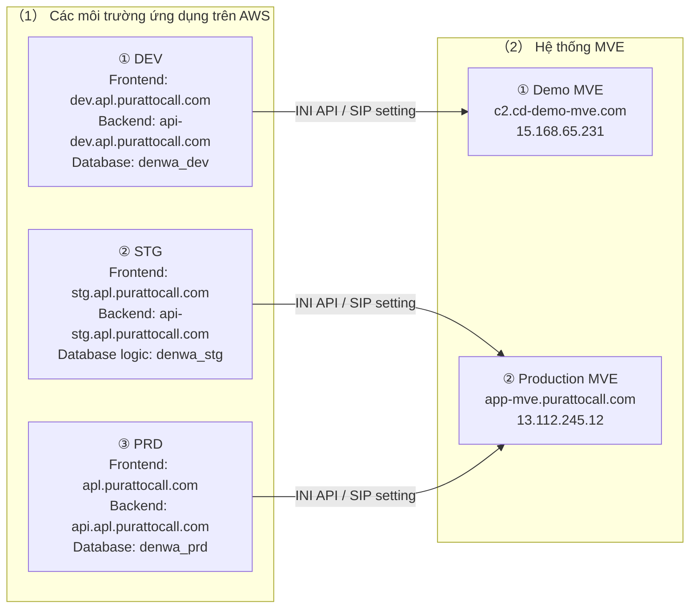
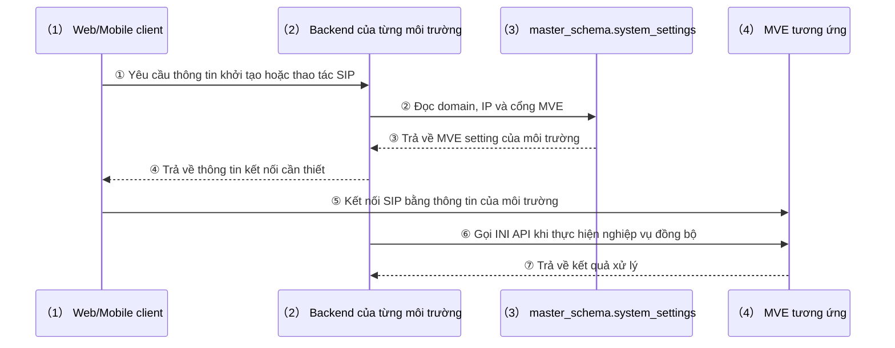

# Sơ đồ cấu hình hệ thống theo môi trường

## 00_表紙

| 項目 | 内容 |
|---|---|
| 文書ID | ARCH-INFRA-02 |
| 文書名 | Sơ đồ cấu hình hệ thống theo môi trường |
| システム名 | VoIP電話システム |
| 対象 | Môi trường DEV, STG, PRD và kết nối MVE |
| 版数 | 0.1.0 |
| 作成日 | 27/07/2026 |
| 作成者 | VTI |
| レビュー担当 | ITEC / VJP |
| 承認者 | - |
| 目的 | Thống nhất cấu hình hiện tại của ba môi trường và MVE tương ứng |
| 期待成果 | Người review xác định được domain, dịch vụ, database và MVE của từng môi trường |
| 文書区分 | 構造設計書 |
| 機密区分 | 関係者限り |
| 状態 | Bản tiếng Việt để review nội bộ |

## 01_改訂履歴

| Ngày | Phiên bản | Nội dung | Người sửa | Người duyệt |
|---|---|---|---|---|
| 27/07/2026 | 0.1.0 | Tạo mới tài liệu tổng hợp cấu hình DEV, STG, PRD và quan hệ kết nối MVE dựa trên tài liệu kiến trúc cũ và kết quả xác minh môi trường hiện tại | VTI | - |

## 目次

| No. | Nội dung | Tên phần |
|---|---|---|
| ① | Trang bìa | 00_表紙 |
| ② | Lịch sử sửa đổi | 01_改訂履歴 |
| ③ | Mục lục | 目次 |
| ④ | Tổng quan | 02_概要 |
| ⑤ | Phạm vi | 03_対象範囲 |
| ⑥ | Tài liệu liên quan | 04_関連資料 |
| ⑦ | Quan hệ môi trường và MVE | 05_環境対応関係 |
| ⑧ | Sơ đồ cấu hình hệ thống | 06_環境別システム構成_01 |
| ⑨ | Giải thích cấu hình hệ thống | 06_環境別システム構成_02 |
| ⑩ | Cấu hình chi tiết | 07_環境別設定 |
| ⑪ | Sơ đồ luồng kết nối MVE | 08_MVE接続フロー_01 |
| ⑫ | Giải thích luồng kết nối MVE | 08_MVE接続フロー_02 |
| ⑬ | Lưu ý vận hành | 09_運用上の注意 |
| ⑭ | Nguồn xác minh | 10_検証記録 |
| ⑮ | Kết luận | 11_結論 |

## 02_概要

### 2.1 Mục đích

Tài liệu này tổng hợp cấu hình hiện tại của môi trường phát triển DEV, môi trường kiểm chứng STG và môi trường production PRD. Mục tiêu chính là giúp các bên thống nhất:

1. Domain và dịch vụ AWS đang được sử dụng cho từng môi trường.
2. Database được sử dụng cho từng môi trường.
3. Mỗi môi trường đang kết nối tới MVE nào.
4. Các tài nguyên dùng riêng và tài nguyên đang dùng chung giữa các môi trường.

Sau khi review tài liệu, người đọc có thể xác định trực tiếp quan hệ DEV/STG/PRD với MVE mà không cần suy đoán từ hostname hoặc tên môi trường.

### 2.2 Kết luận tổng quan

- DEV kết nối Demo MVE.
- STG và PRD là hai môi trường ứng dụng riêng nhưng cùng kết nối Production MVE.
- STG sử dụng database logic riêng là denwa_stg trên RDS của PRD.

## 03_対象範囲

### 3.1 Đối tượng trong phạm vi

- Domain Frontend và Backend.
- ECS cluster và ECS service.
- Database logic được Backend sử dụng.
- MVE endpoint dùng cho SIP và INI API.
- Quan hệ kết nối chính giữa người dùng, Frontend, Backend, database và MVE.

### 3.2 Đối tượng ngoài phạm vi

- Chi tiết subnet, security group và route table.
- Credential, certificate và secret.
- Danh sách SIP user hoặc thông tin tài khoản MVE.
- Cấu hình nội bộ của MVE 1号機 và MVE 2号機.
- Quy trình deploy và thao tác chuyển đổi MVE active node.

## 04_関連資料

| No. | 文書ID | Tài liệu hoặc nguồn liên quan | Quan hệ với tài liệu này |
|---|---|---|---|
| ① | ARCH-INFRA-01 | インフラ構造設計書 | Tài liệu kiến trúc trước đó, sở hữu cấu trúc AWS và domain DEV/PRD |
| ② | ARCH-INFRA-01 | インフラ構造設計 構成図.drawio | Sơ đồ AWS và domain do dự án lập trước đó |
| ③ | - | Cấu hình runtime DEV/STG/PRD | Nguồn xác minh ECS service, database và MVE endpoint hiện tại |

## 05_環境対応関係

### 5.1 Quan hệ môi trường và MVE

| ID | Môi trường | Loại MVE | MVE domain | IP hiện tại | UDP | TLS | Kết luận |
|---|---|---|---|---|---:|---:|---|
| MAP-ENV-001 | DEV | Demo MVE | c2.cd-demo-mve.com | 15.168.65.231 | 5071 | 10183 | DEV được tách khỏi MVE production và sử dụng Demo MVE |
| MAP-ENV-002 | STG | Production MVE | app-mve.purattocall.com | 13.112.245.12 | 5071 | 10183 | STG sử dụng cùng MVE đích với PRD |
| MAP-ENV-003 | PRD | Production MVE | app-mve.purattocall.com | 13.112.245.12 | 5071 | 10183 | PRD sử dụng Production MVE |

Kết luận quan trọng: STG là môi trường ứng dụng riêng nhưng không sử dụng MVE riêng. STG và PRD cùng kết nối tới app-mve.purattocall.com.

### 5.2 Quan hệ ứng dụng, database và MVE

| ID | Môi trường | Frontend | Backend | Database logic | MVE |
|---|---|---|---|---|---|
| MAP-ENV-004 | DEV | dev.apl.purattocall.com | api-dev.apl.purattocall.com | denwa_dev | Demo MVE |
| MAP-ENV-005 | STG | stg.apl.purattocall.com | api-stg.apl.purattocall.com | denwa_stg | Production MVE |
| MAP-ENV-006 | PRD | apl.purattocall.com | api.apl.purattocall.com | denwa_prd | Production MVE |

## 06_環境別システム構成_01

### 6.1 Sơ đồ quan hệ DEV/STG/PRD và MVE

## 06_環境別システム構成_02

Phần này giải thích trách nhiệm và quan hệ kết nối của từng khu vực trong sơ đồ cấu hình hệ thống.

### 6.2 Ý nghĩa sơ đồ

| Khu vực | Thành phần trực tiếp | Quan hệ chính |
|---|---|---|
| （1） Các môi trường ứng dụng trên AWS | ① DEV, ② STG, ③ PRD | Mỗi môi trường có Frontend, Backend và database logic tương ứng |
| （2） Hệ thống MVE | ① Demo MVE, ② Production MVE | DEV dùng Demo MVE; STG và PRD dùng Production MVE |

① Đọc lần lượt ba môi trường ứng dụng trong khu vực （1）, sau đó đối chiếu đường kết nối tới khu vực MVE （2）.

（1） Các môi trường ứng dụng trên AWS

- ① DEV sử dụng Frontend dev.apl.purattocall.com, Backend api-dev.apl.purattocall.com và database denwa_dev.
- ② STG sử dụng Frontend stg.apl.purattocall.com, Backend api-stg.apl.purattocall.com và database logic denwa_stg.
- ③ PRD sử dụng Frontend apl.purattocall.com, Backend api.apl.purattocall.com và database denwa_prd.

（2） Hệ thống MVE

- ① Demo MVE chỉ nhận kết nối từ ① DEV.
- ② Production MVE nhận kết nối từ ② STG và ③ PRD.
- STG và PRD có ứng dụng riêng nhưng cùng sử dụng Production MVE.
- Không có luồng kết nối từ DEV tới Production MVE trong cấu hình hiện tại.

## 07_環境別設定

### 7.1 DEV

| ID | Hạng mục | Giá trị hiện tại |
|---|---|---|
| CFG-ENV-001 | Vai trò | Phát triển và kiểm thử nội bộ |
| CFG-ENV-002 | Frontend domain | dev.apl.purattocall.com |
| CFG-ENV-003 | Backend domain | api-dev.apl.purattocall.com |
| CFG-ENV-004 | ECS cluster | denwa-dev-cluster |
| CFG-ENV-005 | Frontend service | denwa-frontend-service |
| CFG-ENV-006 | Backend service | denwa-backend-task-service-4mh4rz2a |
| CFG-ENV-007 | Spring profile | dev-cloud |
| CFG-ENV-008 | Database | denwa_dev |
| CFG-ENV-009 | MVE | c2.cd-demo-mve.com |
| CFG-ENV-010 | Trạng thái xác minh | Frontend và Backend đang ACTIVE, mỗi service chạy 1/1 task |

### 7.2 STG

| ID | Hạng mục | Giá trị hiện tại |
|---|---|---|
| CFG-ENV-011 | Vai trò | Kiểm chứng trước khi phản ánh lên PRD |
| CFG-ENV-012 | Frontend domain | stg.apl.purattocall.com |
| CFG-ENV-013 | Backend domain | api-stg.apl.purattocall.com |
| CFG-ENV-014 | ECS cluster | denwa-stg-cluster |
| CFG-ENV-015 | Frontend service | denwa-frontend-service-stg |
| CFG-ENV-016 | Backend service | denwa-backend-stg-service |
| CFG-ENV-017 | Spring profile | stg |
| CFG-ENV-018 | Database logic | denwa_stg |
| CFG-ENV-019 | Vị trí database | RDS của PRD; tách biệt bằng database logic |
| CFG-ENV-020 | MVE | app-mve.purattocall.com |
| CFG-ENV-021 | Trạng thái xác minh | Frontend và Backend đang ACTIVE, mỗi service chạy 1/1 task |

### 7.3 PRD

| ID | Hạng mục | Giá trị hiện tại |
|---|---|---|
| CFG-ENV-022 | Vai trò | Môi trường production cho người dùng thực tế |
| CFG-ENV-023 | Frontend domain | apl.purattocall.com |
| CFG-ENV-024 | Backend domain | api.apl.purattocall.com |
| CFG-ENV-025 | ECS cluster | denwa-prd-cluster |
| CFG-ENV-026 | Frontend service | denwa-frontend-prd-service |
| CFG-ENV-027 | Backend service | denwa-backend-prd-service |
| CFG-ENV-028 | Spring profile | pro |
| CFG-ENV-029 | Database | denwa_prd |
| CFG-ENV-030 | MVE | app-mve.purattocall.com |
| CFG-ENV-031 | Trạng thái xác minh | Frontend và Backend đang ACTIVE, mỗi service chạy 1/1 task |

## 08_MVE接続フロー_01

### 8.1 Luồng cấu hình và sử dụng MVE

## 08_MVE接続フロー_02

Phần này giải thích thứ tự Client và Backend lấy cấu hình rồi kết nối tới MVE tương ứng với môi trường.

| Bước | Chủ thể | Nội dung |
|---|---|---|
| ① | Client | Gửi yêu cầu khởi tạo hoặc thao tác SIP |
| ② | Backend | Đọc domain, IP và cổng MVE |
| ③ | Database | Trả cấu hình MVE của môi trường |
| ④ | Backend | Trả thông tin kết nối cho Client |
| ⑤ | Client | Kết nối SIP tới MVE |
| ⑥ | Backend | Gọi INI API khi đồng bộ |
| ⑦ | MVE | Trả kết quả xử lý |

### 8.2 Giải thích luồng

Luồng được đọc theo thứ tự sau:

① Client gửi yêu cầu khởi tạo hoặc thao tác SIP tới Backend của môi trường đang sử dụng.

② Backend đọc domain, IP và cổng MVE từ master_schema.system_settings.

③ Database trả về cấu hình MVE tương ứng với DEV, STG hoặc PRD.

④ Backend trả thông tin kết nối cần thiết cho Client.

⑤ Client kết nối SIP trực tiếp tới MVE tương ứng.

⑥ Khi thực hiện nghiệp vụ đồng bộ, Backend gọi INI API của cùng MVE.

⑦ MVE trả kết quả xử lý cho Backend.

### 8.3 Endpoint INI API

| ID | Môi trường | Endpoint |
|---|---|---|
| IF-MVE-001 | DEV | https://c2.cd-demo-mve.com/api/v1/files/ini |
| IF-MVE-002 | DEV | https://c2.cd-demo-mve.com/api/v1/files/ini/incremental |
| IF-MVE-003 | STG | https://app-mve.purattocall.com/api/v1/files/ini |
| IF-MVE-004 | STG | https://app-mve.purattocall.com/api/v1/files/ini/incremental |
| IF-MVE-005 | PRD | https://app-mve.purattocall.com/api/v1/files/ini |
| IF-MVE-006 | PRD | https://app-mve.purattocall.com/api/v1/files/ini/incremental |

## 09_運用上の注意

1. Khi kiểm thử DEV, chỉ sử dụng Demo MVE. Không sử dụng account hoặc IPGroup của Production MVE.
2. Khi kiểm thử STG có thao tác MVE, cần hiểu rằng thao tác được gửi tới cùng Production MVE mà PRD đang sử dụng.
3. Dữ liệu ứng dụng STG và PRD nằm trong hai database logic khác nhau, nhưng việc tách database không đồng nghĩa với việc tách MVE.
4. Trước khi xử lý sự cố đăng nhập, SIP hoặc cuộc gọi, cần xác định đủ ba thông tin: build đang sử dụng, Backend domain và MVE domain.
5. Không xác định MVE 1号機 hoặc MVE 2号機 chỉ từ hostname hay IP. Tài liệu hiện có chưa định nghĩa mapping vật lý giữa hai tên máy này.
6. Nếu thay đổi MVE active node, cần kiểm tra đồng bộ API user, quyền INI API, chứng thư mTLS và outbound IP allowlist trước khi chuyển đổi.

## 10_検証記録

| ID | Nguồn | Nội dung sử dụng |
|---|---|---|
| SRC-ENV-001 | ARCH-INFRA-01 インフラ構造設計書 và sơ đồ Draw.io | Cấu trúc AWS, domain, ECS và thiết kế DEV/PRD trước đó |
| SRC-ENV-002 | AWS ECS read-only, xác minh ngày 27/07/2026 | ECS cluster, service, task definition, Spring profile và trạng thái chạy của DEV/STG/PRD |
| SRC-ENV-003 | DNS lookup, xác minh ngày 27/07/2026 | Domain ứng dụng và IP của hai MVE |
| SRC-ENV-004 | DEV/PRD master_schema.system_settings, xác minh ngày 27/07/2026 | MVE runtime target của DEV và PRD |
| SRC-ENV-005 | STG master_schema.system_settings trên database denwa_stg, xác minh ngày 27/07/2026 | MVE runtime target của STG |
| SRC-ENV-006 | application-dev-cloud.properties, application-stg.properties và application-pro.properties | INI API endpoint tương ứng với từng Spring profile |

## 11_結論

Cấu hình hiện tại được phân chia thành ba môi trường ứng dụng riêng biệt:

- DEV kết nối Demo MVE.
- STG kết nối Production MVE.
- PRD kết nối Production MVE.

Điểm cần ghi nhớ khi phối hợp vận hành là STG và PRD tách biệt ở tầng ứng dụng và database logic, nhưng dùng chung MVE đích. Đây là nguyên nhân chính có thể gây nhầm lẫn nếu chỉ nhìn tên môi trường mà không kiểm tra MVE domain.
