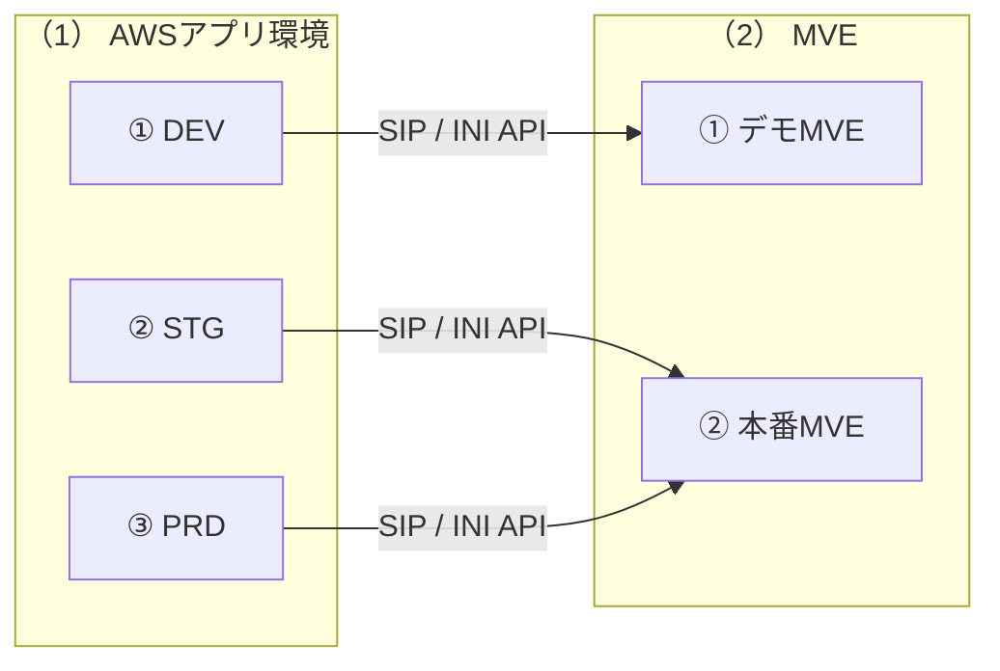
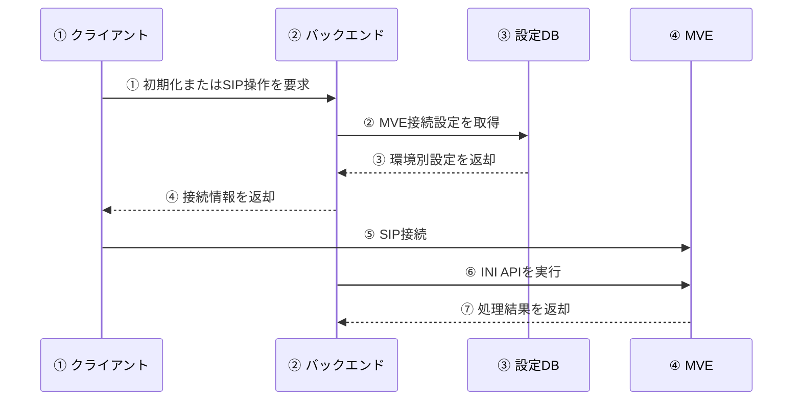

# 環境別システム構成図

## 00_表紙

| 項目 | 内容 |
|---|---|
| 文書ID | ARCH-INFRA-02 |
| 文書名 | 環境別システム構成図 |
| システム名 | VoIP電話システム |
| 対象 | 開発環境（DEV）、検証環境（STG）、本番環境（PRD）およびMVE接続 |
| 版数 | 1.0.0 |
| 作成日 | 2026年7月27日 |
| 作成者 | VTI |
| レビュー担当 | ITEC / VJP |
| 承認者 | - |
| 目的 | 各環境の現行構成と接続先MVEを明確にする |
| 期待成果 | 各環境のドメイン、サービス、データベースおよび接続先MVEを識別できること |
| 文書区分 | 構造設計書 |
| 機密区分 | 関係者限り |

## 01_改訂履歴

| 改訂日 | 版数 | 変更内容 | 改訂者 | 承認者 |
|---|---|---|---|---|
| 2026年7月27日 | 1.0.0 | DEV、STG、PRDのシステム構成およびMVE接続関係を新規整理 | VTI | - |

## 目次

| No. | 内容 | セクション名 |
|---|---|---|
| ① | 表紙 | 00_表紙 |
| ② | 改訂履歴 | 01_改訂履歴 |
| ③ | 目次 | 目次 |
| ④ | 概要 | 02_概要 |
| ⑤ | 対象範囲 | 03_対象範囲 |
| ⑥ | 関連資料 | 04_関連資料 |
| ⑦ | 環境とMVEの対応関係 | 05_環境対応関係 |
| ⑧ | 環境別システム構成図 | 06_環境別システム構成_01 |
| ⑨ | 環境別システム構成の説明 | 06_環境別システム構成_02 |
| ⑩ | 環境別設定 | 07_環境別設定 |
| ⑪ | MVE接続フロー | 08_MVE接続フロー_01 |
| ⑫ | MVE接続フローの説明 | 08_MVE接続フロー_02 |
| ⑬ | 運用上の注意 | 09_運用上の注意 |
| ⑭ | 検証記録 | 10_検証記録 |
| ⑮ | 結論 | 11_結論 |

## 02_概要

### 2.1 目的

本書は、開発環境（DEV）、検証環境（STG）、本番環境（PRD）の現行システム構成と、各環境から接続するMVEを整理したものである。

本書により、次の内容を確認できる。

① 各環境で使用するドメイン、ECSサービスおよびデータベース

② 各環境から接続するMVE

③ 環境ごとに分離されるリソースと、複数環境で共用するリソース

### 2.2 構成上の結論

① DEVはデモMVEに接続する

② STGとPRDは別々のアプリ環境であるが、同じ本番MVEに接続する

③ STGはPRD用RDS上の論理データベース denwa_stg を使用し、PRDの denwa_prd とは論理的に分離する

## 03_対象範囲

### 3.1 対象

① フロントエンドおよびバックエンドのドメイン

② ECSクラスターおよびECSサービス

③ バックエンドが使用する論理データベース

④ SIP接続およびINI APIで使用するMVE接続先

⑤ 利用者、フロントエンド、バックエンド、データベースおよびMVEの主な接続関係

### 3.2 対象外

① サブネット、セキュリティグループおよびルートテーブルの詳細

② 認証情報、証明書およびシークレット

③ SIPユーザーおよびMVEアカウントの一覧

④ MVE 1号機およびMVE 2号機の内部構成

⑤ デプロイ手順およびMVE稼働系切替手順

## 04_関連資料

| No. | 文書ID | 資料名 | 本書との関係 |
|---|---|---|---|
| ① | ARCH-INFRA-01 | インフラ構造設計書 | AWS構成およびDEV・PRDのドメイン構成を参照 |
| ② | ARCH-INFRA-01 | インフラ構造設計 構成図.drawio | 既存のAWS構成図を参照 |
| ③ | - | DEV・STG・PRDの稼働設定 | ECSサービス、データベースおよびMVE接続先の現行値を確認 |

## 05_環境対応関係

### 5.1 環境とMVEの対応

| No. | 環境 | MVE区分 | MVEドメイン | IPアドレス | UDP | TLS |
|---|---|---|---|---|---:|---:|
| ① | DEV | デモMVE | c2.cd-demo-mve.com | 15.168.65.231 | 5071 | 10183 |
| ② | STG | 本番MVE | app-mve.purattocall.com | 13.112.245.12 | 5071 | 10183 |
| ③ | PRD | 本番MVE | app-mve.purattocall.com | 13.112.245.12 | 5071 | 10183 |

STGは独立したアプリ環境であるが、専用MVEは使用しない。STGとPRDは、どちらも app-mve.purattocall.com に接続する。

### 5.2 アプリ、データベースおよびMVEの対応

| No. | 環境 | フロントエンド | バックエンド | 論理データベース | MVE |
|---|---|---|---|---|---|
| ① | DEV | dev.apl.purattocall.com | api-dev.apl.purattocall.com | denwa_dev | デモMVE |
| ② | STG | stg.apl.purattocall.com | api-stg.apl.purattocall.com | denwa_stg | 本番MVE |
| ③ | PRD | apl.purattocall.com | api.apl.purattocall.com | denwa_prd | 本番MVE |

## 06_環境別システム構成_01

### 6.1 環境別システム構成図

## 06_環境別システム構成_02

本節では、環境別システム構成図の境界と接続関係を説明する。

### 6.2 構成の見方

| No. | 区分 | 構成要素 | 接続関係 |
|---|---|---|---|
| ① | （1）AWSアプリ環境 | DEV、STG、PRD | 各環境から対応するMVEへ接続する |
| ② | （2）MVE | デモMVE、本番MVE | DEVはデモMVE、STGとPRDは本番MVEを使用する |

（1）AWSアプリ環境

① DEVは、DEV用のフロントエンド、バックエンドおよび論理データベースで構成する

② STGは、STG用のフロントエンド、バックエンドおよび論理データベースで構成する

③ PRDは、PRD用のフロントエンド、バックエンドおよび論理データベースで構成する

（2）MVE

① デモMVEはDEVからの接続に使用する

② 本番MVEはSTGおよびPRDからの接続に使用する

## 07_環境別設定

### 7.1 DEV

| No. | 項目 | 現行値 |
|---|---|---|
| ① | 用途 | 開発および社内試験 |
| ② | フロントエンドドメイン | dev.apl.purattocall.com |
| ③ | バックエンドドメイン | api-dev.apl.purattocall.com |
| ④ | ECSクラスター | denwa-dev-cluster |
| ⑤ | フロントエンドサービス | denwa-frontend-service |
| ⑥ | バックエンドサービス | denwa-backend-task-service-4mh4rz2a |
| ⑦ | Springプロファイル | dev-cloud |
| ⑧ | 論理データベース | denwa_dev |
| ⑨ | MVE | c2.cd-demo-mve.com |
| ⑩ | 稼働状態 | フロントエンド、バックエンドともにACTIVE、各サービス1/1タスク |

### 7.2 STG

| No. | 項目 | 現行値 |
|---|---|---|
| ① | 用途 | PRD反映前の検証 |
| ② | フロントエンドドメイン | stg.apl.purattocall.com |
| ③ | バックエンドドメイン | api-stg.apl.purattocall.com |
| ④ | ECSクラスター | denwa-stg-cluster |
| ⑤ | フロントエンドサービス | denwa-frontend-service-stg |
| ⑥ | バックエンドサービス | denwa-backend-stg-service |
| ⑦ | Springプロファイル | stg |
| ⑧ | 論理データベース | denwa_stg |
| ⑨ | データベース配置 | PRD用RDS上で論理分離 |
| ⑩ | MVE | app-mve.purattocall.com |
| ⑪ | 稼働状態 | フロントエンド、バックエンドともにACTIVE、各サービス1/1タスク |

### 7.3 PRD

| No. | 項目 | 現行値 |
|---|---|---|
| ① | 用途 | 実利用者向け本番環境 |
| ② | フロントエンドドメイン | apl.purattocall.com |
| ③ | バックエンドドメイン | api.apl.purattocall.com |
| ④ | ECSクラスター | denwa-prd-cluster |
| ⑤ | フロントエンドサービス | denwa-frontend-prd-service |
| ⑥ | バックエンドサービス | denwa-backend-prd-service |
| ⑦ | Springプロファイル | pro |
| ⑧ | 論理データベース | denwa_prd |
| ⑨ | MVE | app-mve.purattocall.com |
| ⑩ | 稼働状態 | フロントエンド、バックエンドともにACTIVE、各サービス1/1タスク |

## 08_MVE接続フロー_01

### 8.1 MVE接続フロー

## 08_MVE接続フロー_02

本節では、クライアントとバックエンドが環境別設定を使用してMVEへ接続する順序を説明する。

### 8.2 処理順序

| No. | 実行主体 | 処理 |
|---|---|---|
| ① | クライアント | 初期化またはSIP操作を要求する |
| ② | バックエンド | MVE接続設定を取得する |
| ③ | 設定データベース | 環境別設定を返却する |
| ④ | バックエンド | 接続情報を返却する |
| ⑤ | クライアント | MVEへSIP接続する |
| ⑥ | バックエンド | MVEのINI APIを実行する |
| ⑦ | MVE | 処理結果を返却する |

① クライアントは、利用中の環境のバックエンドへ初期化要求またはSIP操作要求を送信する

② バックエンドは、master_schema.system_settings からMVEのドメイン、IPアドレスおよびポートを取得する

③ 設定データベースは、DEV、STGまたはPRDに対応するMVE設定を返却する

④ バックエンドは、クライアントへ接続情報を返却する

⑤ クライアントは、取得した接続情報を使用してMVEへSIP接続する

⑥ 同期処理を行う場合、バックエンドは同じMVEのINI APIを実行する

⑦ MVEは、バックエンドへ処理結果を返却する

### 8.3 INI APIエンドポイント

| No. | 環境 | エンドポイント |
|---|---|---|
| ① | DEV | https://c2.cd-demo-mve.com/api/v1/files/ini |
| ② | DEV | https://c2.cd-demo-mve.com/api/v1/files/ini/incremental |
| ③ | STG | https://app-mve.purattocall.com/api/v1/files/ini |
| ④ | STG | https://app-mve.purattocall.com/api/v1/files/ini/incremental |
| ⑤ | PRD | https://app-mve.purattocall.com/api/v1/files/ini |
| ⑥ | PRD | https://app-mve.purattocall.com/api/v1/files/ini/incremental |

## 09_運用上の注意

① DEVで試験する場合は、デモMVEを使用する。本番MVEのアカウントおよびIPGroupは使用しない

② STGからMVEを操作する場合、その操作はPRDと同じ本番MVEへ送信される

③ STGとPRDのアプリデータは異なる論理データベースに格納するが、MVEは分離されていない

④ ログイン、SIPまたは通話に関する事象を確認する場合は、使用中のビルド、バックエンドドメインおよびMVEドメインを確認する

⑤ MVEのホスト名またはIPアドレスだけで、MVE 1号機またはMVE 2号機を判定しない。現行資料では、両機とホスト名・IPアドレスの対応関係を定義していない

⑥ MVEの稼働系を切り替える場合は、APIユーザー、INI API権限、mTLS証明書および送信元IP許可設定の同期状態を確認する

## 10_検証記録

| No. | 確認元 | 確認内容 |
|---|---|---|
| ① | ARCH-INFRA-01 インフラ構造設計書、構成図 | AWS構成、ドメイン、ECSおよび既存のDEV・PRD設計 |
| ② | AWS ECS参照結果（2026年7月27日） | DEV・STG・PRDのECSクラスター、サービス、タスク定義、Springプロファイルおよび稼働状態 |
| ③ | DNS参照結果（2026年7月27日） | アプリドメインおよびMVEのIPアドレス |
| ④ | DEV・PRDの master_schema.system_settings（2026年7月27日） | DEVおよびPRDのMVE接続先 |
| ⑤ | denwa_stg の master_schema.system_settings（2026年7月27日） | STGのMVE接続先 |
| ⑥ | application-dev-cloud.properties、application-stg.properties、application-pro.properties | SpringプロファイルごとのINI APIエンドポイント |

## 11_結論

現行構成では、DEV、STGおよびPRDを個別のアプリ環境として構成している。

① DEVはデモMVEに接続する

② STGは本番MVEに接続する

③ PRDは本番MVEに接続する

STGとPRDは、アプリおよび論理データベースを分離しているが、接続先MVEは共用している。そのため、環境を確認する場合は、環境名だけでなくMVEドメインも合わせて確認する。
