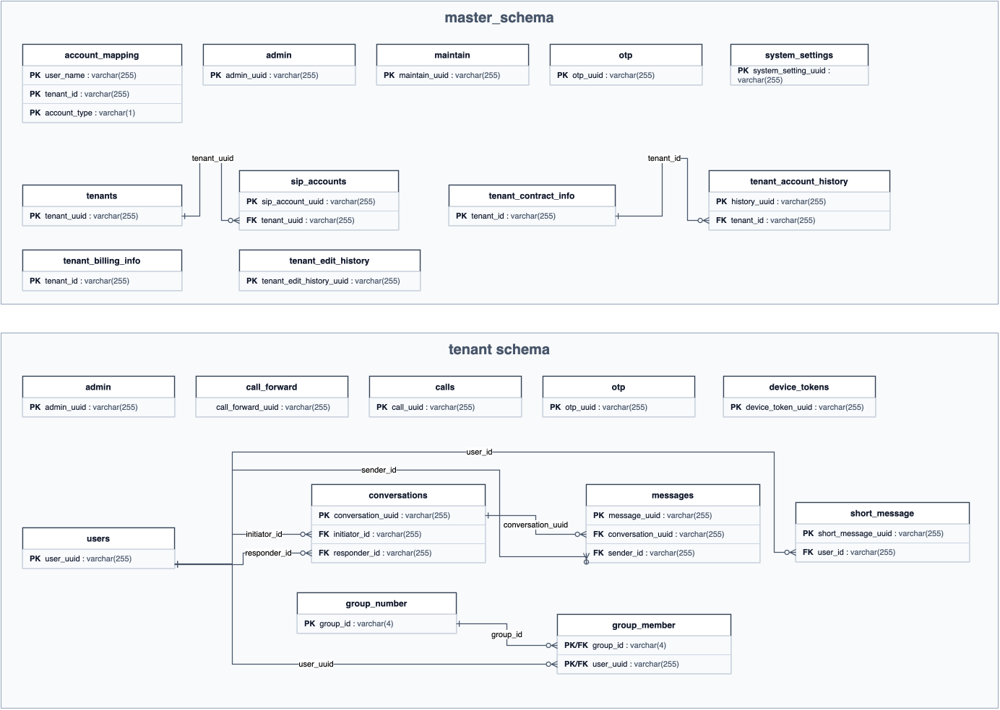

# DB-TABLE-01 テーブル定義書 ERD

## 関係一覧

| No | スキーマ | FKテーブル | FKカラム | 参照先テーブル | 参照先カラム |
| ---: | --- | --- | --- | --- | --- |
| 1 | master_schema | sip_accounts | tenant_uuid | tenants | tenant_uuid |
| 2 | master_schema | tenant_account_history | tenant_id | tenant_contract_info | tenant_id |
| 3 | tenant schema | conversations | initiator_id | users | user_uuid |
| 4 | tenant schema | conversations | responder_id | users | user_uuid |
| 5 | tenant schema | messages | conversation_uuid | conversations | conversation_uuid |
| 6 | tenant schema | messages | sender_id | users | user_uuid |
| 7 | tenant schema | short_message | user_id | users | user_uuid |
| 8 | tenant schema | group_member | group_id | group_number | group_id |
| 9 | tenant schema | group_member | user_uuid | users | user_uuid |
