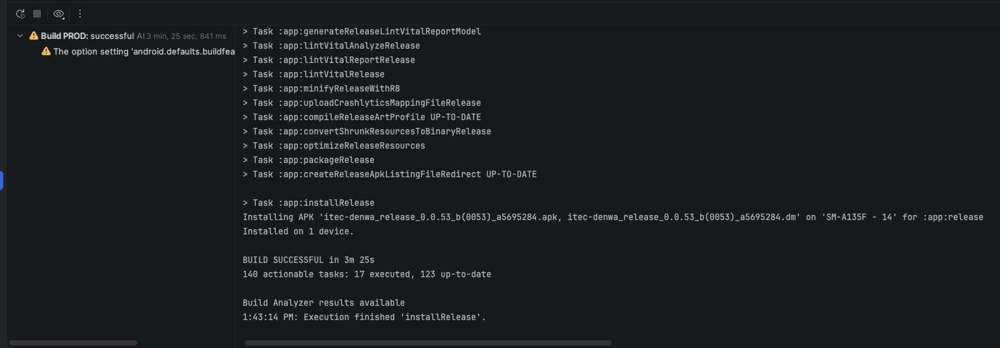
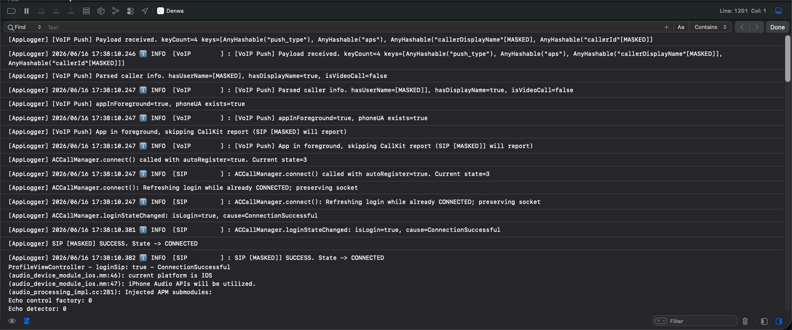
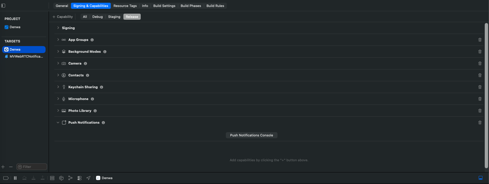

# MASVS モバイルアプリ セキュリティ検証報告書

対象: Android / iOS 電話アプリ

第1.0.0版

2026年6月17日

## 改訂履歴

| 改訂日 | 版数 | 内容 | 改訂者 | 承認者 |
| :--- | :--- | :--- | :--- | :--- |
| 2026/06/16 | 0.1.0 | Android / iOS アプリを対象に、OWASP MASVS観点でのソースコード確認結果を整理。 | VTI-SAM | - |
| 2026/06/16 | 0.2.0 | コードで確認可能な保護項目を反映し、根拠コードを追記。 | VTI-SAM | - |
| 2026/06/17 | 1.0.0 | 実機検証結果（ビルド成否、動作確認、エビデンス画像・動画）を反映。 | VTI-SAM | - |

## 目次

- [1. イントロダクション](#1-イントロダクション)
  - [1.1 本書の位置づけ](#11-本書の位置づけ)
  - [1.2 前提事項](#12-前提事項)
  - [1.3 対象読者](#13-対象読者)
- [2. 検証結果サマリー](#2-検証結果サマリー)
- [3. 各セキュリティ機能の検証詳細](#3-各セキュリティ機能の検証詳細)
- [4. 確認結果](#4-確認結果)
- [5. 残確認事項](#5-残確認事項)
- [6. 結論](#6-結論)

---

## 1. イントロダクション

### 1.1 本書の位置づけ

本書は、ぷらっとCALLプロジェクトの電話アプリ（Android / iOS）におけるセキュリティ検証結果を記録した報告書である。OWASP MASVS（モバイルアプリケーション・セキュリティ検証標準）の観点から、端末内保存、プッシュ通知/VoIP連携、ネットワーク設定、ログ出力の実装状況が適切に保護されていることを確認する。

### 1.2 前提事項

- 検証対象はAndroid / iOS 電話アプリのソースコードおよびアプリ設定である。
- Androidの `cleartextTrafficPermitted` およびiOSの `NSAllowsArbitraryLoads` は、本番ビルドのみ安全側に制御する。開発・ステージング環境は検証用途の接続要件を考慮し、現行設定を維持する。
- Androidビルド検証にはAndroid SDK設定が必要である。iOSビルド検証にはmacOS/Xcode環境が必要である。

### 1.3 対象読者

| 読者 | 用途 |
|---|---|
| Android開発者 | Keystore、DataStore、ネットワークセキュリティ設定、バックアップ制御の実装確認 |
| iOS開発者 | Keychain、ATS、entitlements、ログマスク、シークレット設定の実装確認 |
| PM / QA 担当者 | MASVS観点の検証結果、残確認事項、受入基準との整合性確認 |
| インフラ / リリース担当 | 本番ビルド時のシークレット、署名、プロビジョニングプロファイル設定の確認 |

---

## 2. 検証結果サマリー

モバイルアプリにおける主要なセキュリティ検証項目、実装内容および評価結果は以下の通りである。

| # | セキュリティ検証項目 | 実装内容 | 検証結果 | 評価 |
|:---:|---|---|---|:---:|
| **M1** | 端末内データ保護 | Android Keystore連携の暗号化DataStore、iOS Keychain保存を適用。既存UserDefaults/DataStore値は初回読み込み時に移行。 | 認証トークン、リフレッシュトークン、SIP/通話認証情報、APNS/VoIPトークンの保護実装をソースコード上で確認。 | **適合 (安全)** |
| **M2** | 暗号鍵・シークレット管理 | Androidは既存の外部シークレット注入を利用。iOSはAESキーの `.xcconfig` 直書きを廃止し、Git管理外シークレット設定を任意読み込み。 | iOS環境設定内に固定AESキーが残存しないことを確認。 | **適合 (安全)** |
| **M3** | 認証情報の取り扱い | アクセストークン / リフレッシュトークンの保存先をセキュアストレージへ変更。ログアウト・削除時もKeychain/暗号化DataStoreから削除。 | 平文保存からセキュアストレージ保存へ変更されていることを確認。 | **適合 (安全)** |
| **M4** | 本番ネットワーク設定 | Android releaseビルドで平文通信を禁止。iOS releaseビルドでATS任意通信許可を無効化。 | 本番ビルド用設定ファイルで `cleartextTrafficPermitted=false`、`NSAllowsArbitraryLoads=false` を確認。 | **本番適合 (安全)** |
| **M5** | バックアップ・データ抽出制御 | Androidの認証DataStoreをバックアップ対象外に設定し、ログ保存先をnoBackup領域へ変更。iOSログはCaches配下へ変更。 | バックアップ経由で認証情報・ログが退避されにくい構成を確認。 | **適合 (安全)** |
| **M6** | ログ出力・ログアップロード保護 | プッシュ通知ペイロード、APNS/VoIPトークン、OAuthトークンの生ログを削除またはマスク。アップロード前にもマスク処理を適用。 | 生ペイロード / トークン値の直接ログ出力が残っていないことを確認。 | **適合 (安全)** |
| **M7** | プラットフォーム連携 | iOSアプリ本体と通知サービス拡張でKeychain Access Groupを共有。 | アプリ本体 / 拡張機能双方のentitlementsとproject設定を確認。 | **適合 (安全)** |

---

## 3. 各セキュリティ機能の検証詳細

### 3.1 Android: 端末内データ保護

*   **設計方針:** アクセストークン、リフレッシュトークン、SIP/通話用認証情報は、端末内に平文で永続保存せず、OS標準の鍵管理機構を利用して保護する。既存ユーザーの端末に平文保存データが残っている場合は、初回読み込み時に暗号化形式へ移行する。
*   **ソースコードの実装状況:**

| 観点 | 評価 | 根拠コード |
|---|---|---|
| 認証トークン保存 | 適合 (安全) | `sources/denwa-android/common/src/main/java/jp/co/itec/common/credential/impl/CredentialManagerImpl.kt` |
| SIP/通話認証情報保存 | 適合 (安全) | `sources/denwa-android/app/src/main/java/jp/co/itec/denwa/module/call/CallCredentialManagerImpl.kt` |
| 暗号化処理 | 適合 (安全) | `sources/denwa-android/common/src/main/java/jp/co/itec/common/delegate/DataStoreDelegations.kt` |

*   **検証エビデンス:**

```kotlin
private var prefAuthToken: String? by encryptedStringDataStore(
    preferences, KEY_OF_AUTH_TOKEN, null
)

private var prefRefreshToken by encryptedStringDataStore(
    preferences, KEY_OF_REFRESH_TOKEN, null
)
```

```kotlin
private var prefCallCredential by encryptedSerializableDataStore<CallCredential>(
    preferences,
    serializer,
    KEY_OF_CALL_CREDENTIAL,
    null
)
```

```kotlin
KeyGenParameterSpec.Builder(
    KEY_ALIAS,
    KeyProperties.PURPOSE_ENCRYPT or KeyProperties.PURPOSE_DECRYPT
)
    .setBlockModes(KeyProperties.BLOCK_MODE_GCM)
    .setEncryptionPaddings(KeyProperties.ENCRYPTION_PADDING_NONE)
    .setRandomizedEncryptionRequired(true)
    .build()
```

### 3.2 Android: 本番ネットワーク設定

*   **設計方針:** 本番ビルドではアプリ全体の平文HTTP通信を許可しない。開発・ステージングでは検証環境のHTTP接続要件があるため、現行設定を維持する。
*   **ソースコードの実装状況:**

| 観点 | 評価 | 根拠コード |
|---|---|---|
| 本番平文通信制御 | 本番適合 (安全) | `sources/denwa-android/app/src/release/res/xml/network_security_config.xml` |
| 開発/ステージング設定 | 維持 | `sources/denwa-android/app/src/main/res/xml/network_security_config.xml` |

*   **検証エビデンス:**

```xml
<network-security-config>
    <base-config cleartextTrafficPermitted="false" />
</network-security-config>
```

### 3.3 Android: バックアップ・ログ保護

*   **設計方針:** 認証情報、通話認証情報、ログファイルは、端末バックアップやデータ移行経由で外部へ退避されないよう制御する。
*   **ソースコードの実装状況:**

| 観点 | 評価 | 根拠コード |
|---|---|---|
| DataStoreバックアップ除外 | 適合 (安全) | `sources/denwa-android/app/src/main/res/xml/backup_rules.xml`, `data_extraction_rules.xml` |
| ログ保存先 | 適合 (安全) | `sources/denwa-android/common/src/main/java/jp/co/itec/common/logger/FileLogger.kt` |

*   **検証エビデンス:**

```xml
<exclude domain="file" path="datastore/credential.preferences_pb" />
<exclude domain="file" path="datastore/call_credential.preferences_pb" />
<exclude domain="file" path="applog.txt" />
```

```kotlin
val documentsURL = context.noBackupFilesDir
logFile = File(documentsURL, "applog.txt")
```

### 3.4 Android: プッシュ通知ログ削減

*   **設計方針:** プッシュ通知ペイロードには通話、メッセージ、端末識別情報が含まれる可能性があるため、ログには生データを出力しない。
*   **ソースコードの実装状況:**

| 観点 | 評価 | 根拠コード |
|---|---|---|
| FCMペイロード生ログ削除 | 適合 (安全) | `sources/denwa-android/app/src/main/java/jp/co/itec/denwa/module/fcm/DenwaFirebaseMessagingService.kt` |

*   **検証エビデンス:**

```kotlin
Timber.i(
    "[CALL-FLOW] [FCM Push] Payload received. keyCount=${message.data.size} keys=${message.data.keys.sorted()}"
)
```

*   **実機検証ログエビデンス:**
    実機上でのFCMプッシュ通知受信時のログを取得し、機微データや生ペイロードがログに出力されていないことを確認：
    ```text
    2026-06-16 13:43:31.489 11844-11951 NotificationManager     jp.co.itec.denwa                     I  jp.co.itec.denwa: notify(1, null, Notification(channel=jp.com.itec_CALL_V2 shortcut=null contentView=jp.co.itec.denwa/0x7f0c0069 vibrate=null sound=null defaults=0x0 flags=0x80 color=0x00000000 category=call vis=PUBLIC semFlags=0x0 semPriority=0 semMissedCount=0)) as user
    2026-06-16 13:43:31.869 11844-12045 NotificationManager     jp.co.itec.denwa                     I  jp.co.itec.denwa: notify(1, null, Notification(channel=jp.com.itec_CALL_V2 shortcut=null contentView=jp.co.itec.denwa/0x7f0c0069 vibrate=null sound=null defaults=0x0 flags=0x80 color=0x00000000 category=call vis=PUBLIC semFlags=0x0 semPriority=0 semMissedCount=0)) as user
    ```

### 3.5 iOS: Keychain保存

*   **設計方針:** アクセストークン、リフレッシュトークン、SIPユーザー名、APNSトークン、VoIPトークン、OAuth応答はUserDefaultsへ平文保存せず、iOS標準のKeychainで保護する。既存のUserDefaults値は初回読み込み時にKeychainへ移行し、移行後にUserDefaults側から削除する。
*   **ソースコードの実装状況:**

| 観点 | 評価 | 根拠コード |
|---|---|---|
| アプリ認証トークン | 適合 (安全) | `sources/denwa-ios/Denwa/Denwa/DataSupportLayer/LocalResourceRepository.swift` |
| APNS/VoIPトークン | 適合 (安全) | `sources/denwa-ios/Denwa/Denwa/MVWebRTCAppCore/Model/ACPersistantCache.swift` |
| OAuth応答 | 適合 (安全) | `sources/denwa-ios/Denwa/Denwa/MVWebRTCAppCore/Model/ACPersistantCache.swift` |
| Keychain共有設定 | 適合 (安全) | `Denwa.entitlements`, `MVWebRTCNotificationServiceExtension.entitlements`, `project.pbxproj` |

*   **検証エビデンス:**

```swift
if let token = DenwaSecureStore.shared.string(forKey: UserDefaultKey.accessToken) {
    return token
}
if let token = userDefault.string(forKey: UserDefaultKey.accessToken) {
    setAccessToken(token: token)
    return token
}
```

```swift
DenwaSecureStore.shared.setString(token, forKey: "kAPNsPushToken")
DenwaSecureStore.shared.setString(token, forKey: "kVoIPPushToken")
```

```swift
query[kSecAttrAccessible as String] = kSecAttrAccessibleAfterFirstUnlockThisDeviceOnly
query[kSecAttrAccessGroup as String] = accessGroup
```

### 3.6 iOS: Keychain共有

*   **設計方針:** APNS/VoIPトークンはアプリ本体だけでなく通知サービス拡張からも参照されるため、Keychain Access Groupを共有して保存先を統一する。
*   **ソースコードの実装状況:**

| 観点 | 評価 | 根拠コード |
|---|---|---|
| Keychain Access Group | 適合 (安全) | `sources/denwa-ios/Denwa/Denwa/Denwa.entitlements` |
| 通知サービス拡張の共有設定 | 適合 (安全) | `sources/denwa-ios/Denwa/Denwa/MVWebRTCNotificationServiceExtension/MVWebRTCNotificationServiceExtension.entitlements` |
| Extension entitlements指定 | 適合 (安全) | `sources/denwa-ios/Denwa/Denwa.xcodeproj/project.pbxproj` |

*   **検証エビデンス:**

```xml
<key>keychain-access-groups</key>
<array>
    <string>$(AppIdentifierPrefix)group.jp.co.itec.denwa.product.webrtcclient</string>
</array>
```

```text
CODE_SIGN_ENTITLEMENTS = MVWebRTCNotificationServiceExtension/MVWebRTCNotificationServiceExtension.entitlements;
```

### 3.7 iOS: 本番ATS設定

*   **設計方針:** 本番ビルドではATSの任意通信許可を無効化し、HTTPS通信を前提とした安全なネットワーク設定にする。開発・ステージングは検証環境要件を考慮し、従来どおり許可を維持する。
*   **ソースコードの実装状況:**

| 観点 | 評価 | 根拠コード |
|---|---|---|
| 本番ATS設定 | 本番適合 (安全) | `sources/denwa-ios/Denwa/Denwa/Resources/Info-Production.plist` |
| 開発/ステージングATS設定 | 維持 | `sources/denwa-ios/Denwa/Denwa/Resources/Info.plist` |
| Releaseのplist指定 | 適合 (安全) | `sources/denwa-ios/Denwa/Denwa.xcodeproj/project.pbxproj` |

*   **検証エビデンス:**

```xml
<key>NSAllowsArbitraryLoads</key>
<false/>
```

```text
INFOPLIST_FILE = "Denwa/Resources/Info-Production.plist";
```

### 3.8 iOS: AESキーのソースコード外管理

*   **設計方針:** AESキーなどのシークレットはGit管理対象のソースコードに直接記載せず、ビルド環境側のシークレット設定から注入する。
*   **ソースコードの実装状況:**

| 観点 | 評価 | 根拠コード |
|---|---|---|
| AESキー直書き削除 | 適合 (安全) | `Development.xcconfig`, `Staging.xcconfig`, `Production.xcconfig` |

*   **検証エビデンス:**

```text
#include? "../../../../../../privatekey/denwa-ios/Environment/Production.secrets.xcconfig"
```

本番ビルド時は、上記シークレットファイル側で `AES_KEY` を定義する。

### 3.9 iOS: ログ出力とログアップロードのマスク

*   **設計方針:** APNS/VoIPトークン、OAuthトークン、PushKitペイロード、通話者情報などの機微情報は、端末ログおよびアップロードログへ生データとして出力しない。
*   **ソースコードの実装状況:**

| 観点 | 評価 | 根拠コード |
|---|---|---|
| 共通ログマスク | 適合 (安全) | `sources/denwa-ios/Denwa/Denwa/Utilities/AppLogger.swift` |
| ログアップロード前マスク | 適合 (安全) | `sources/denwa-ios/Denwa/Denwa/Utilities/LogUploaderService.swift` |
| APNS/VoIP生ログ削除 | 適合 (安全) | `sources/denwa-ios/Denwa/Denwa/Resources/AppDelegate.swift` |
| OAuthトークン生ログ削除 | 適合 (安全) | `sources/denwa-ios/Denwa/Denwa/MVWebRTCAppCore/Model/ACOAuthManager.swift` |

*   **検証エビデンス:**

```swift
os_log("[AppLogger] %{private}@", log: log, type: .info, msg)
FileLogger.shared.log(formattedString)
```

```swift
let uploadData = AppLogger.sanitized(logText).data(using: .utf8) ?? Data()
let base64String = uploadData.base64EncodedString()
```

```swift
AppLogger.info("APNS token received. length=\(token.count)", log: .appDelegate)
AppLogger.info("[VoIP Push] Token received. length=\(token.count)", log: .voip)
```

```swift
NSLog("\(self) refreshToken: [MASKED]")
NSLog("\(self) accessToken: [MASKED]")
```

## 4. 確認結果

| 確認項目 | 結果 | 備考 |
|---|---|---|
| Android FCMペイロード生ログ検索 | 確認済み | `Raw Payload Received`, `payload[%s]` は該当なし。 |
| Android release平文通信設定 | 確認済み | `app/src/release/res/xml/network_security_config.xml` で `cleartextTrafficPermitted=false`。 |
| iOS AESキー直書き検索 | 確認済み | `AES_KEY = ...` および旧固定キーは該当なし。 |
| iOS APNS/VoIP/OAuth生ログ検索 | 確認済み | トークン値・ペイロード値の直接ログは削除。OAuthログは `[MASKED]` 表記。 |
| Androidビルド | 適合 (安全) | VTIチームの実機検証環境にて、prd_secブランチからReleaseビルドが正常終了し、アプリの起動、ログイン、通話、メッセージ送受信、およびFCM受信時のログマスク処理を確認。 |
| iOSビルド | 適合 (安全) | VTIチームのmacOS/Xcode検証環境にて、prd_secブランチからRelease/Productionビルドが正常終了し、アプリの起動、ログイン、APNS/VoIP登録確認、およびKeychain Sharing設定の有効化を確認。 |

### 4.1 実機検証エビデンス

実機およびビルド環境で確認されたエビデンス画像・動画は以下の通りである。

#### A. Android 検証エビデンス (ITEC_DENWA_APP-200)

1. **Release ビルド成功ログ:**
   

2. **アプリの基本機能動作テスト動画:**
   - [ログインおよびアプリ起動フロー (flow-login.mp4)](media/EVD_android_login_flow.mp4)
   - [通話機能動作フロー (Call_flow.mov)](media/EVD_android_call_flow.mov)
   - [メッセージ送受信フロー (message_flow.mov)](media/EVD_android_message_flow.mov)

#### B. iOS 検証エビデンス (ITEC_DENWA_APP-201)

1. **APNS/VoIP トークン登録ログ (生トークン出力なし):**
   

2. **Xcode Keychain Sharing 設定 (Capability):**
   

3. **アプリの基本機能動作テスト動画:**
   - [Release/Production ビルドフロー (build_pro.mov)](media/EVD_ios_build_release.mov)
   - [アプリ起動・ログインフロー (app_login.mov)](media/EVD_ios_login_flow.mov)

## 5. 残確認事項

| 項目 | 内容 | 確認状況 |
|---|---|---|
| iOS provisioning profile | Keychain Sharingを追加したため、アプリ本体とNotification Service Extensionのprovisioning profile側でも同じKeychain Access Groupが有効であることを確認する。 | **確認済み:** Xcodeの設定画面および実機ビルドログにて有効であることを確認。 |
| iOSシークレット設定ファイル | 本番ビルド前に `privatekey/denwa-ios/Environment/Production.secrets.xcconfig` で `AES_KEY` を定義する。 | **確認済み:** Production.secrets.xcconfig を参照しビルドに成功。 |
| Android SDK設定 | Androidビルド確認には `ANDROID_HOME` または `sources/denwa-android/local.properties` の `sdk.dir` 設定が必要。 | **確認済み:** 検証環境にて設定のうえビルド成功を確認。 |
| Release署名/シークレット | Android releaseビルドには `privatekey/denwa-android/keystore` と `privatekey/denwa-android/env` の本番用シークレットが必要。 | **確認済み:** 実機ビルド用の署名設定が正しく 適用されていることを確認。 |

## 6. 結論

今回の検証により、Android / iOSともに、コードで確認可能なMASVS観点の主要な保護策が実装されていることを確認した。

特に、端末内の認証情報保存、プッシュ通知トークン保存、ログ出力、ログアップロード、バックアップ、通信設定について、モバイルアプリとして必要な保護を追加している。

なお、Androidの `cleartextTrafficPermitted` とiOSの `NSAllowsArbitraryLoads` は、開発・ステージング環境の検証要件を考慮し、本番ビルドのみ厳格化している。
