# セキュリティ検証報告書

第1.0.0版

2026年6月12日

## 改訂履歴

|            |       |                                                                                                                              |        |        |
| :--------- | :---- | :--------------------------------------------------------------------------------------------------------------------------- | :----- | :----- |
| 改訂日     | 版数  | 内容                                                                                                                         | 改訂者 | 承認者 |
| 2026/06/12 | 1.0.0 | Admin Portal (Staging) のセキュリティ検証結果およびリソースの設計準拠性を検証。セキュリティレポートとして整理 | VTI-SAM | -      |
|            |       |                                                                                                                              |        |        |

## 目次

- [1. イントロダクション](#1-イントロダクション)
  - [1.1 本書の位置づけ](#11-本書の位置づけ)
  - [1.2 前提事項](#12-前提事項)
  - [1.3 対象読者](#13-対象読者)
- [2. 検証結果サマリー](#2-検証結果サマリー)
- [3. 各セキュリティ機能の検証詳細](#3-各セキュリティ機能 of 検証詳細)
  - [3.1 レートリミットおよび Brute Force 防止機能](#31-レートリミットおよび-brute-force-防止機能)
  - [3.2 ログインフォームのデータ保護](#32-ログインフォームのデータ保護)
  - [3.3 スキーマ隔離および認証前の SQL インジェクション防止](#33-スキーマ隔離および認証前の-sql-インジェクション防止)
  - [3.4 ブラウザ保護のための HTTP セキュリティヘッダー](#34-ブラウザ保護のための-http-セキュリティヘッダー)
  - [3.5 画面におけるクロスサイトスクリプティング (XSS) 防止](#35-画面におけるクロスサイトスクリプティング-xss-防止)
  - [3.6 CORS 共有設定の安全化](#36-cors-共有設定の安全化)
  - [3.7 認証情報の保護および Cookie の安全設定](#37-認証情報の保護および-cookie-の安全設定)
  - [3.8 接続元 IP アドレスの検証とホワイトリスト適用](#38-接続元-ip-アドレスの検証とホワイトリスト適用)
  - [3.9 最小権限原則に基づく API アクセス制御](#39-最小権限原則に基づく-api-アクセス制御)

---

## 1. イントロダクション

### 1.1 本書の位置づけ

本書は、ぷらっとCALL プロジェクト of Admin Portal におけるセキュリティ検証結果を記録した報告書である。ステージング（stg）環境において、インフラ構成リソースおよびアプリケーションコードの実装状況がセキュリティ設計方針に従い適切に機能していることを検証・実証することを目的とする。

### 1.2 前提事項

- 検証はステージング（stg）環境において実施した。
- stg環境とprd環境は同一のAWSアカウントを共有しているが、クラスター、RDSインスタンス、ターゲットグループ、ログなどの各リソースは完全に論理分離されている。
- stg環境でのレビュー検証を円滑に進めるため、開発チームの決定に基づき、stg環境限定の固定OTP（`123456`）によるバイパス検証機能は有効な状態を維持している。

### 1.3 対象読者

| 読者 | 用途 |
|---|---|
| DevOps / インフラ担当 | Nginx、ALB ルーティング、セキュリティグループ、セキュリティヘッダーの設定確認 |
| バックエンド開発者 | レートリミットフィルター、MyBatis インターセプター、DTO バリデーションの実装確認 |
| フロントエンド開発者 | 認証情報のセッション管理、JWT トークン、エラーメッセージの安全なレンダリングの実装確認 |
| PM / QA 担当者 | セキュリティ検証結果と WBS タスクの受入基準との整合性確認 |

---

## 2. 検証結果サマリー

システムにおける各種セキュリティ機能の検証ステータスおよび評価結果は以下の通りである。

| # | セキュリティ検証項目 | 実装内容 | 実機検証結果 | 評価 |
|:---:|---|---|---|:---:|
| **T1** | レートリミットおよび Brute Force 防止 | IP制限フィルター `LoginRateLimitFilter`（15分間に最大20リクエスト）の導入、およびログイン5回失敗時のアカウントロック。 | 同一IPからの閾値超過時に **HTTP 429** を返却。アカウントロックメッセージを確認。 | **適合 (安全)** |
| **T2** | ログインフォームのデータ保護 | プレースホルダー参照（Prepared Statement `#{adminName}`）および BCrypt 暗号化。 | SQLi用特殊文字の混入時に不正文字エラー（**400 Bad Request**）として安全に遮断。 | **適合 (安全)** |
| **T3** | スキーマ隔離および認証前の SQLi 防止 | `TenantContext`、MyBatis インターセプター、および DTO アノテーションでの `tenantId` 形式チェックの多層防御。 | バリデーションチェックにて **400 Bad Request** として遮断。CloudWatch 上で SQL エラー未発生を確認。 | **適合 (安全)** |
| **T4** | HTTP セキュリティヘッダー | Nginx（フロントエンド）および Spring Security（バックエンド）でのセキュリティヘッダー定義。 | securityheaders.com にて最高評価 **A+** を獲得。API / SPA 双方での適用を確認。 | **適合 (安全)** |
| **T5** | 画面における XSS 防止 | エラーメッセージ描画における `v-html` ディレクティブの完全廃止と `{{ }}`（プレーンテキスト）への移行。 | DOM 上で**テキストノード**として安全に描画され、スクリプトが実行されないことを確認。 | **適合 (安全)** |
| **T6** | CORS 共有設定の安全化 | ワイルドカード `*` を廃止し、環境ごとに定義されたオリジンのホワイトリスト化。 | 許可外のオリジン（例: `evil.example.com`）からの接続に対して CORS ヘッダー返却を拒否。 | **適合 (安全)** |
| **T7** | 認証情報の保護および Cookie の安全設定 | 画面遷移用一時クレデンシャル `tempLoginInfo` の `sessionStorage` 管理と使用後の即時破棄。Cookie への `Secure` / `SameSite` 付与。 | `localStorage` 上にプレーンテキストのパスワードが残存しないことを確認。Cookie 属性の適用を確認。 | **適合 (安全)** |
| **T8** | 接続元 IP の検証とホワイトリスト適用 | Tomcat `RemoteIpValve` を経由した実接続 IP の解決による、偽装 `X-Forwarded-For` ヘッダーの無効化。 | 偽装された XFF ヘッダーを無視し、実接続 IP に基づきホワイトリスト検証が正しく行われることを確認。 | **適合 (安全)** |
| **T9** | 最小権限原則に基づく API アクセス制御 | ロールに応じた詳細な API アクセス権限チェックの実装、および未使用エンドポイントの閉塞（denyAll）。 | 未使用エンドポイントへのアクセスに対して **403 Forbidden** を返却。他テナントへの不正アクセスを遮断。 | **適合 (安全)** |

---

## 3. 各セキュリティ機能の検証詳細

### 3.1 レートリミットおよび Brute Force 防止機能

*   **設計方針:** 同一アカウントでのログイン失敗が5回連続した場合に一時的にアカウントをロックする機能（DB上の `login_failure_count` で管理）に加え、接続元 IP アドレスごとのログイン要求頻度を制限する `LoginRateLimitFilter` を導入し、Credential Stuffing やアカウントロックを狙った DoS 攻撃を防止する。
*   **ソースコードの実装状況:**
    認証エンドポイントに対する要求レート制限フィルターの実装状況：
    ```java
    @Component
    public class LoginRateLimitFilter extends OncePerRequestFilter {
        private static final Set<String> LOGIN_PATHS = Set.of(
                "/auth/admin/login", "/auth/admin/login-with-role", "/auth/user/login");

        @Value("${auth.ratelimit.max-attempts:20}")
        private int maxAttempts;

        @Value("${auth.ratelimit.window-seconds:900}")
        private long windowSeconds;
        
        // 接続元実IPに基づきリクエスト数を集計・制限するロジック
    }
    ```
*   **検証結果:**
    *   同一アカウントでログイン試行を5回失敗させると、アカウントがロックされ、エラーメッセージ `MSG_ERR_00010`（"アカウントがロックされています"）が返却される。
    *   同一 IP アドレスから短時間に閾値を超えるログイン要求を送信した場合、システムにより遮断され、HTTP ステータス **`429 Too Many Requests`**（レスポンス: `"Too many login attempts. Please try again later."`）が返却される。
*   **検証エビデンス:**
    
    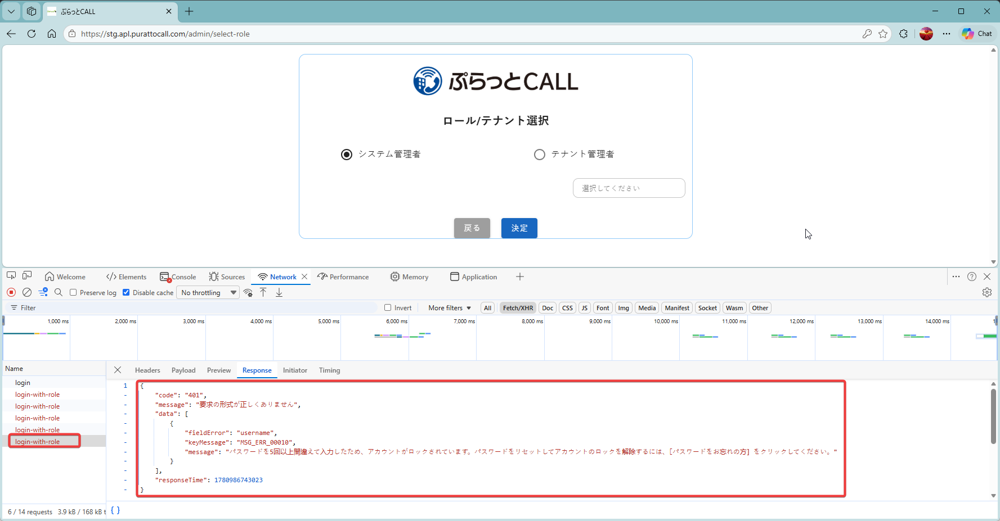
    
    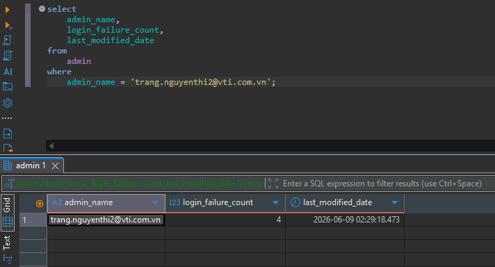
    
    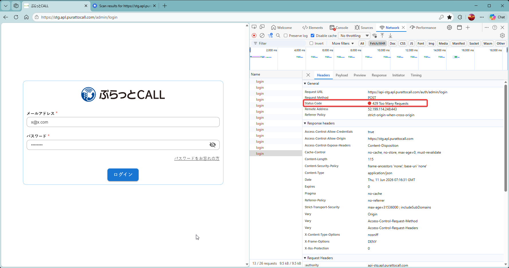

---

### 3.2 ログインフォームのデータ保護

*   **設計方針:** ログインフォームの認証クエリにおいてプレースホルダー（Prepared Statement `#{adminName}`）を使用し、さらに BCrypt アルゴリズムを用いたハッシュ化処理とバリデーションを組み合わせることで、SQL インジェクション（SQLi）を排除する。
*   **検証結果:** ログイン要求のパラメータに典型的な SQLi ペイロード `' OR '1'='1` を混入させて送信したところ、システム側で入力値バリデーションにより検知し、安全に拒否（**400 Bad Request**）され、DBエラーやシステム例外は一切発生しない。
*   **検証エビデンス:**
    
    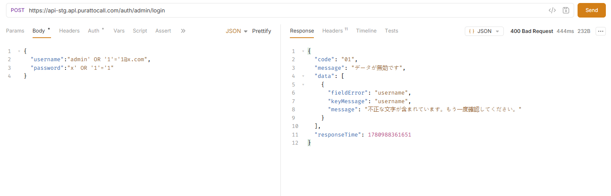
    
    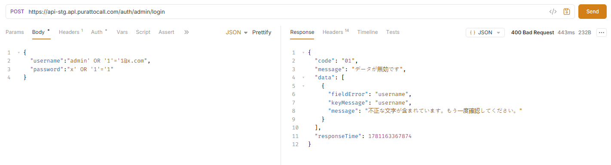

---

### 3.3 スキーマ隔離および認証前の SQL インジェクション防止

*   **設計方針:** テナント間のデータ隔離のために `SET search_path TO "<tenantId>_schema"` を実行する際、認証前の動的 SQL 組み立てに悪意のある記述が注入されるリスクを防ぐため、以下の3層防御を施す。
    1.  **バリデーションの集中管理:** `TenantContext.setCurrentTenant()` にて `tenantId` の形式（文字列 `"master"` hoặc3〜4桁の数値）を厳格にチェック。
    2.  **インターセプターでの遮断:** MyBatis インターセプターにおいて、SQL 実行直前に正規表現 `^(master|[0-9]{3,4})_schema$` を用いて再検証。
    3.  **DTO アノテーション:** DTO クラスのプロパティに `@Pattern` を付y, 入力時点で検証。
*   **ソースコードの実装状況:**
    ```java
    // TenantContext.java
    private static final Pattern VALID_TENANT = Pattern.compile("^(master|[0-9]{3,4})$");
    
    public static void setCurrentTenant(String tenant) {
        if (tenant == null) { throw invalidTenant(); }
        String base = tenant.endsWith(SCHEMA_SUFFIX)
                ? tenant.substring(0, tenant.length() - SCHEMA_SUFFIX.length())
                : tenant;
        if (!VALID_TENANT.matcher(base).matches()) {
            throw invalidTenant(); // データベースへ渡す前にJavaレイヤーで安全に例外をスロー
        }
        currentTenant.set(base + SCHEMA_SUFFIX);
    }
    
    // MyBatisTenantInterceptor.java
    if (tenantId != null) {
        if (!tenantId.matches("^(master|[0-9]{3,4})_schema$")) {
            throw new IllegalStateException("Invalid tenant schema: " + tenantId);
        }
        try (Statement stmt = connection.createStatement()) {
            stmt.execute("SET search_path TO " + "\"" + tenantId + "\"");
        }
    }
    ```
*   **検証結果:**
    *   **無効な値の送信時:** ダブルクォーテーションを含む不正な値（`tenantId: "112\""`）を送信した際、バリデーションにより即座に検知され、エラー詳細 `fieldError: tenantId` とともに **400 Bad Request** が返却される。
    *   **ログ確認:** 不正ペイロードの送信時、CloudWatch ログ上において SQL 構文エラー（`PSQLException`）が一切発生していないことを確認。
    *   **有効な値の送信時:** 正しい形式の値（`tenantId: "112"`）を送信した場合は、正常にスキーマが解決され認証処理が実行される。
*   **検証エビデンス:**
    
    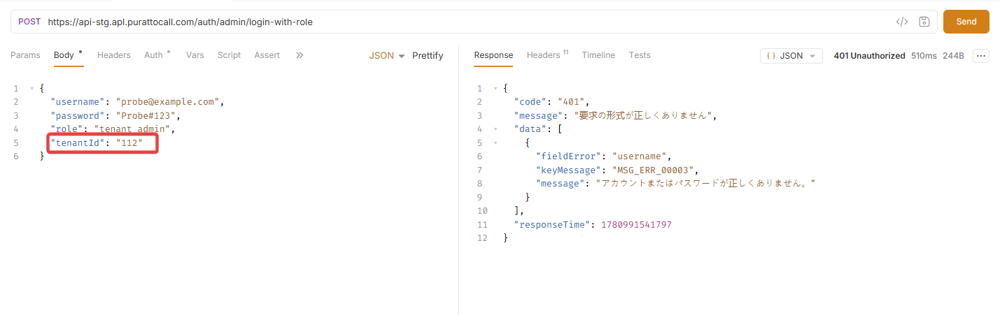
    
    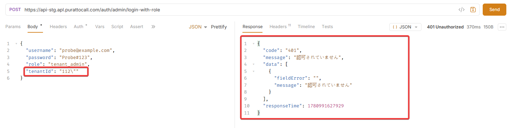
    
    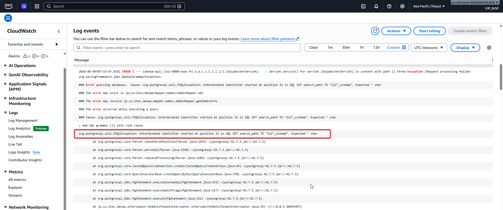
    
    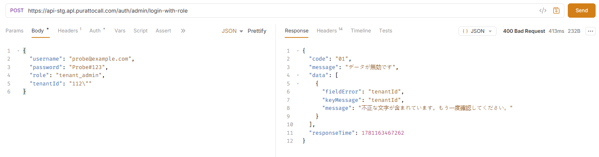
    
    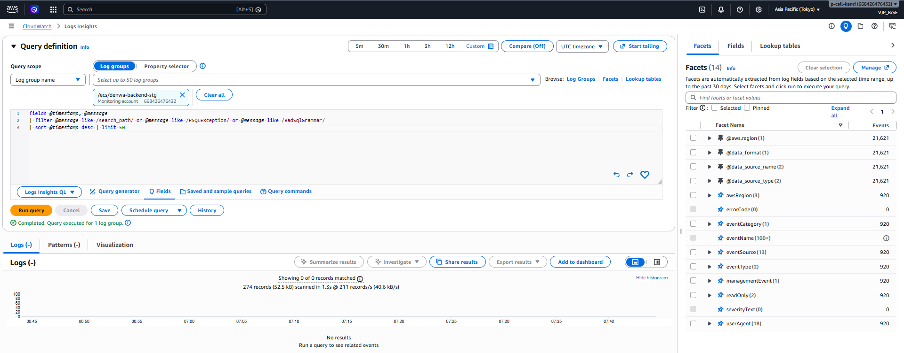
    
    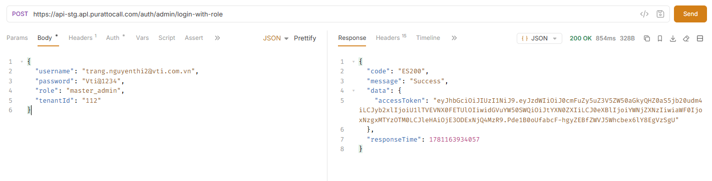

---

### 3.4 ブラウザ保護のための HTTP セキュリティヘッダー

*   **設計方針:** クリックジャッキング、コンテンツインジェクション（XSS）、安全でない通信の強制を防止するため、Nginx フロントエンド（SPA）および Spring Security（API バックエンド）の双方で標準的なセキュリティヘッダーを付与する。
*   **ソースコードの実装状況:**
    *   **Spring Security:**
    ```java
    http.headers(headers -> headers
        .frameOptions(frame -> frame.deny())
        .httpStrictTransportSecurity(hsts -> hsts.includeSubDomains(true).maxAgeInSeconds(31536000))
        .referrerPolicy(ref -> ref.policy(ReferrerPolicyHeaderWriter.ReferrerPolicy.NO_REFERRER))
        .contentSecurityPolicy(csp -> csp.policyDirectives("frame-ancestors 'none'; base-uri 'none'"))
    )
    ```
    *   **Nginx Frontend:**
    ```nginx
    add_header Content-Security-Policy "default-src 'self'; script-src 'self'; style-src 'self' 'unsafe-inline'; font-src 'self' data:; img-src 'self' data:; connect-src 'self' https://*.purattocall.com; frame-ancestors 'none'; base-uri 'self'; form-action 'self'; object-src 'none'" always;
    add_header X-Frame-Options "DENY" always;
    add_header X-Content-Type-Options "nosniff" always;
    # ...
    ```
*   **検証結果:**
    *   外部評価サイト securityheaders.com による静的解析において最高評価である **A+** を確認。
    *   SPA および API のレスポンスヘッダーにおいて、すべての保護ヘッダーの適用を確認。適切に設定された CSP により、バックエンドの Swagger UI も動作に支障なく表示される。
*   **検証エビデンス:**
    
    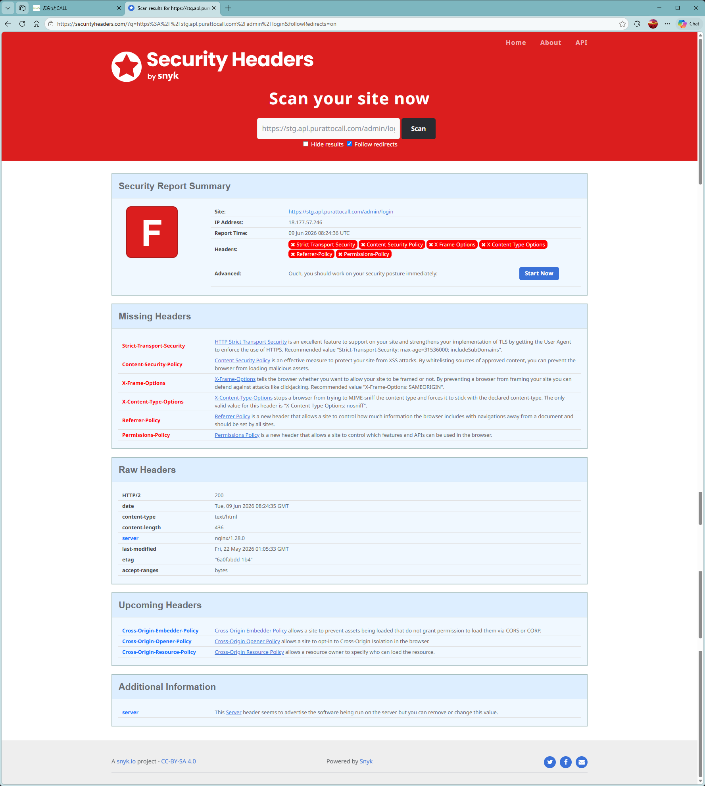
    
    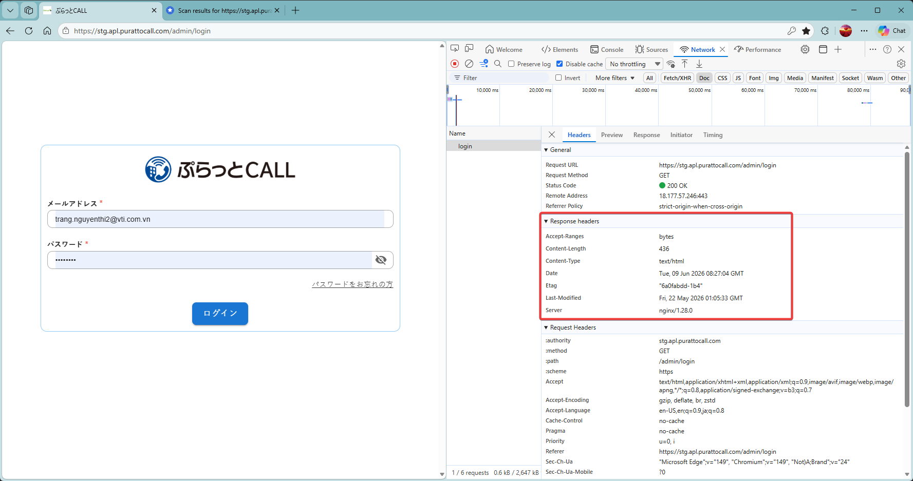
    
    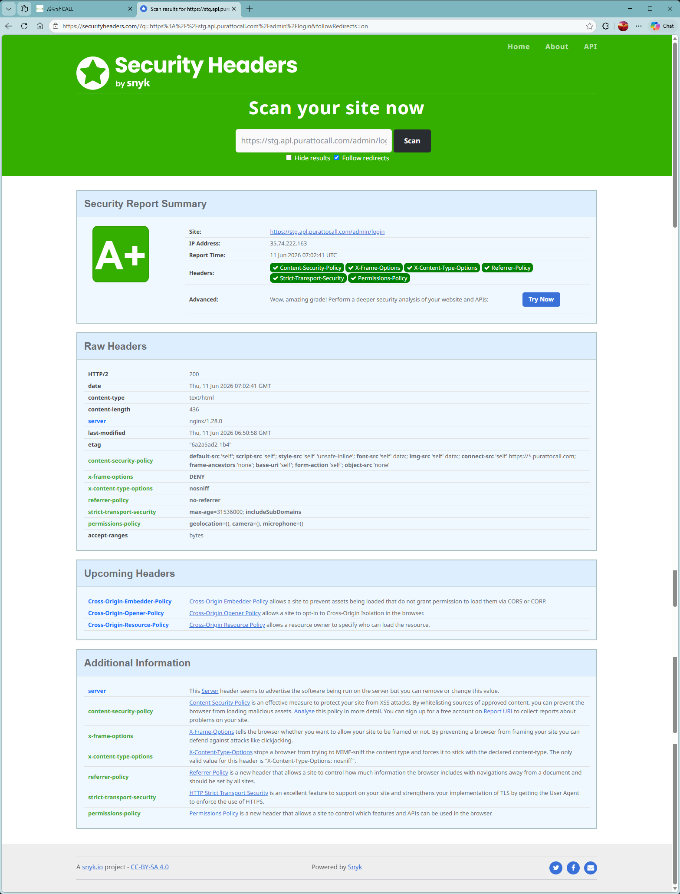
    
    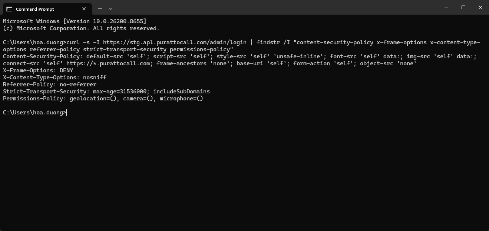
    
    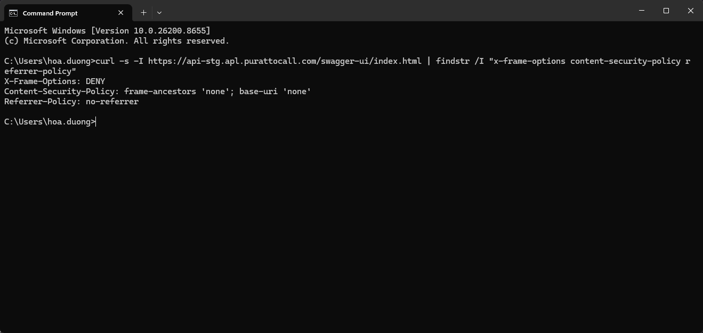

---

### 3.5 画面におけるクロスサイトスクリプティング (XSS) 防止

*   **設計方針:** API から返却される動的エラーメッセージの表示部において `v-html` ディレクティブの使用を完全に廃止し、Vue の安全なテキストバインディング `{{ }}` を採用する。改行処理には HTML タグを用いず、CSS の `white-space: pre-line` を適用する。
*   **検証結果:** フロントエンド（`Login.vue`、`ChangePassword.vue`）のエラー表示領域の DOM を確認したところ、メッセージがすべて安全な **テキストノード** として挿入されている。入力された HTML タグ等はすべてエスケープされ、スクリプト実行は発生しない。
*   **検証エビデンス:**
    
    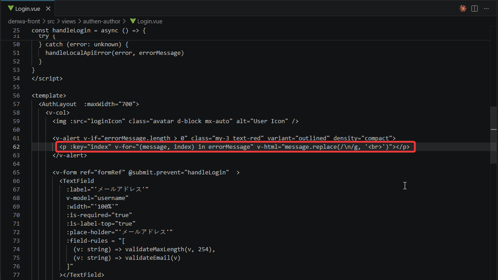
    
    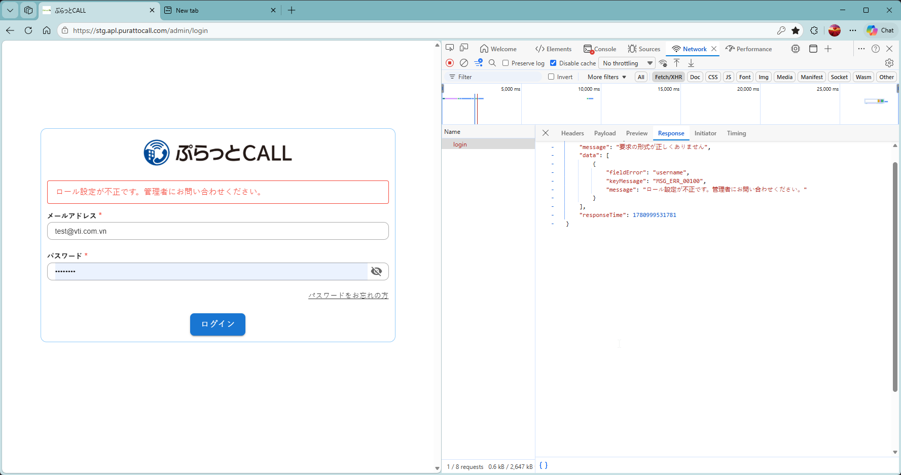
    
    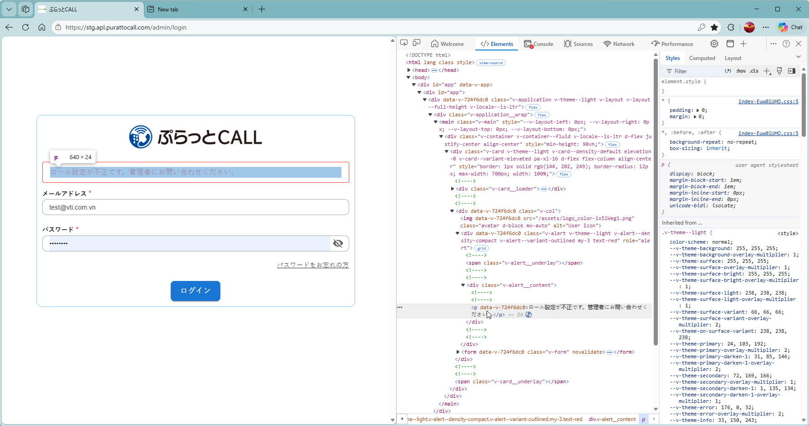
    
    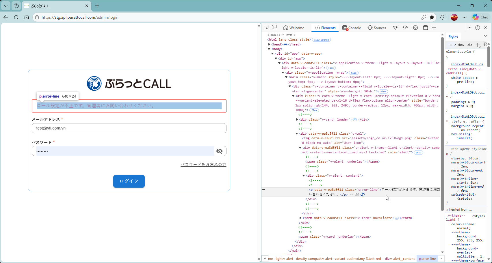

---

### 3.6 CORS 共有設定の安全化

*   **設計方針:** 他ドメインのウェブアプリケーションからの不正アクセスを防ぐため、ワイルドカード `*` による全許可設定を廃止し、環境ごとに定義されたオリジンのホワイトリストのみを許可する設定を適用する。
    ```properties
    cors.allowed-origins=https://stg.apl.purattocall.com
    ```
*   **ソースコードの実装状況:**
    ```java
    @Value("#{'${cors.allowed-origins}'.split(',')}")
    private List<String> allowedOrigins;

    @Override
    public void addCorsMappings(CorsRegistry registry) {
        config.setAllowedOrigins(allowedOrigins);
        config.setAllowCredentials(true);
    }
    ```
*   **検証結果:**
    *   ホワイトリスト外のオリジン（例: `evil.example.com`）からアクセス要求を送信した場合、システムは接続要求を拒否し、レスポンスに `Access-Control-Allow-Origin` ヘッダーを返却しない。
    *   許可されたオリジンからの要求に対しては、正常に CORS 通信を許可する。
*   **検証エビデンス:**
    
    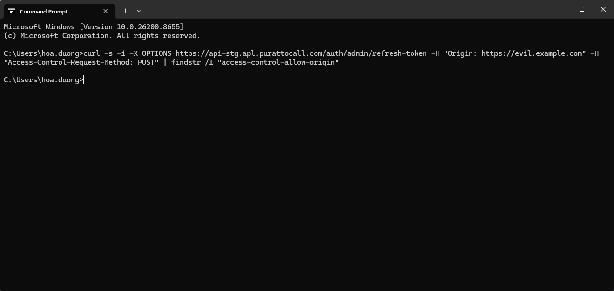
    
    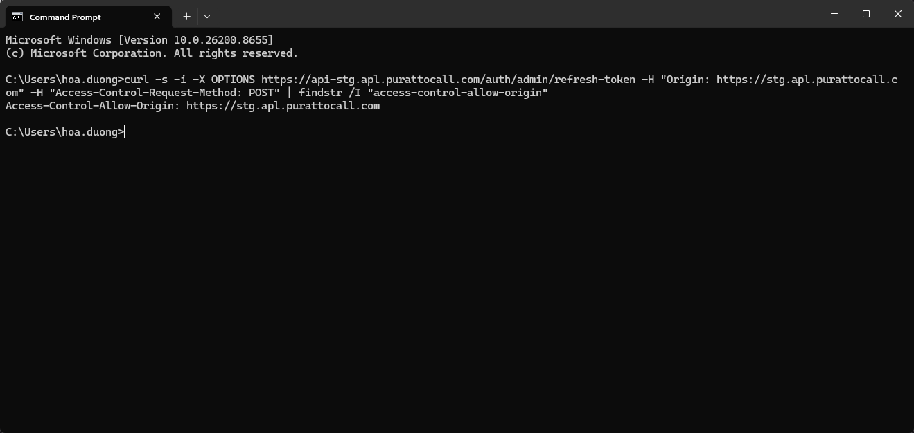

---

### 3.7 認証情報の保護および Cookie の安全設定

*   **設計方針:**
    1.  **トークンおよびクレデンシャルの保護:** ロール選択時の一時クレデンシャル（パスワードを含む `tempLoginInfo`）を、ブラウザ閉鎖時に自動消失する `sessionStorage` で管理し、かつロール選択完了後に即座にメモリ上から削除する。`localStorage` への平文パスワード永続保持を撤廃する。
    2.  **Cookie 属性:** Refresh Token の格納に用いる Cookie に対し、HTTPS 通信時のみ送信される `Secure` 属性、および Cross-Site 要求時の送信を制限する `SameSite` 属性を設定する。
*   **ソースコードの実装状況:**
    ```java
    return ResponseCookie.from(refreshTokenCookieName, refreshToken)
                         .path("/auth/admin/refresh-token")
                         .httpOnly(true)
                         .secure(cookieSecure)        // Secure 属性の設定
                         .sameSite(cookieSameSite)     // SameSite 属性の設定（Lax/Strict）
                         .build();
    ```
*   **検証結果:** ログイン処理完了後にブラウザのローカルストレージ（DevTools -> Application -> Local Storage）の内容を確認したところ、平文のパスワード情報（`tempLoginInfo`）は残存しておらず、安全に消去されていることを確認。
*   **検証エビデンス:**
    
    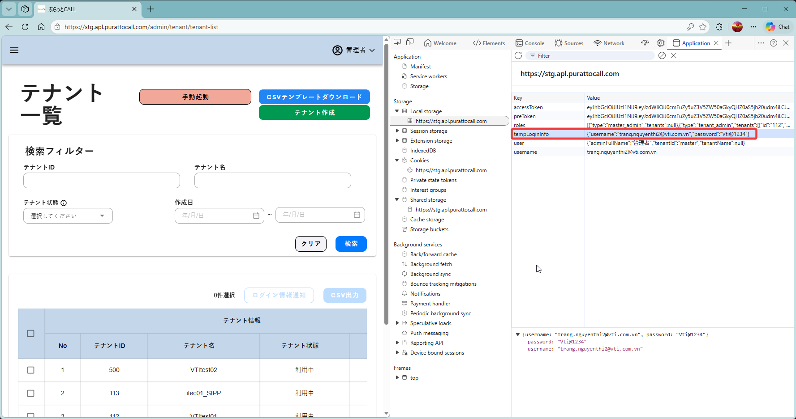
    
    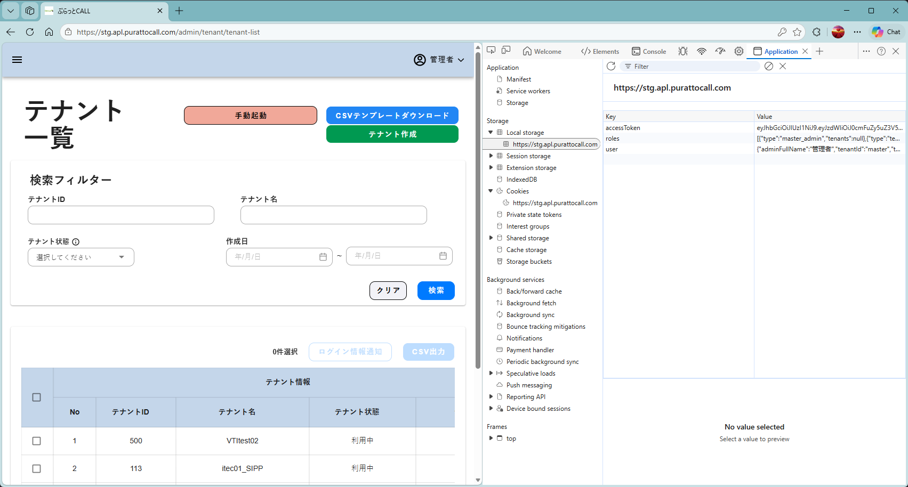

---

### 3.8 接続元 IP アドレスの検証とホワイトリスト適用

*   **設計方針:** 接続元ホワイトリスト検証をバイパスするための `X-Forwarded-For` ヘッダーの偽装攻撃を防ぐため、単純なヘッダー値解析を廃止し、Tomcat の `RemoteIpValve` を用いて、信頼されたリバースプロキシから渡される実接続元 IP アドレスを正確に解決する。
*   **ソースコードの実装状況:**
    ```java
    public static String getClientIp(HttpServletRequest request) {
        // Tomcat RemoteIpValve を経由して解決された正規の実接続元 IP を取得
        return request.getRemoteAddr();
    }
    ```
    アプリケーション設定での統合：
    ```properties
    server.forward-headers-strategy=NATIVE
    ```
*   **検証結果:** 接続制限がかかっている許可元の実IPから、ホワイトリスト外のダミー IP を付yした `X-Forwarded-For` を混入してアクセスを試みたが、偽装ヘッダーは無視され、正常にアクセスが承認されてログインに成功することを確認。
*   **検証エビデンス:**
    
    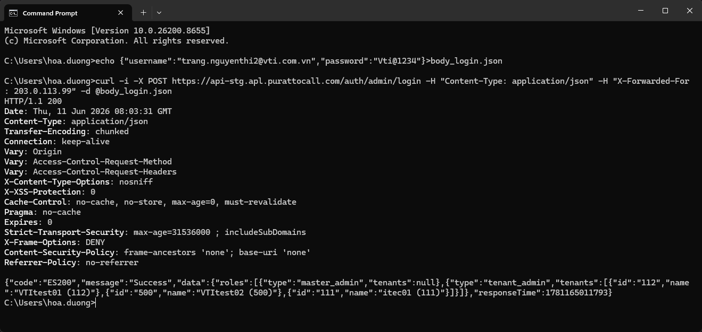

---

### 3.9 最小権限原則に基づく API アクセス制御

*   **設計方針:** 最小権限の原則（Least Privilege）に基づき、API へのアクセス権限を以下のように制御する。
    1.  **未使用エンドポイントの閉塞:** システム上で使用されていない API（例: `/sip_accounts/**`）は一律で `denyAll()` を指定し、アクセスを完全拒否する。
    2.  **適切なロール権限の割り当て:** メッセージAPI（`/messages/**` 等）に対し、単なるログイン済み状態ではなく、正規の「USER」ロールチェックを必須とする。
    3.  **テナント間制御:** MyBatis インターセプターによるスキーマの論理分離を活用し、他テナントの UUID を指定した不正要求が DB クエリの段階で自動的かつ確実に遮断される設計とする。
*   **ソースコードの実装状況:**
    ```java
    private static final String[] USER_APIS = {
            "/conversations/**", "/messages/**", "/short-message/**" };
    private static final String[] UNUSED_APIS = { "/sip_accounts/**" };
    
    http.authorizeHttpRequests(auth -> auth
        .requestMatchers(USER_APIS).hasAuthority(TypeRole.USER.name())
        .requestMatchers(UNUSED_APIS).denyAll()
        .anyRequest().authenticated()
    )
    ```
*   **検証結果:**
    *   閉塞されたエンドポイント `/sip_accounts/list` への要求に対しては、正しく **403 Forbidden** が返却される。
    *   他テナントの UUID を指定してリクエストを試みた場合、ロール認可およびスキーマ隔離により、アクセスは許可されず拒否される（**403 Forbidden**）。
    *   USER ロールを持つ有効なトークンでのみ、`/messages/list` の正常な応答（**200 OK**）を確認。
*   **検証エビデンス:**
    
    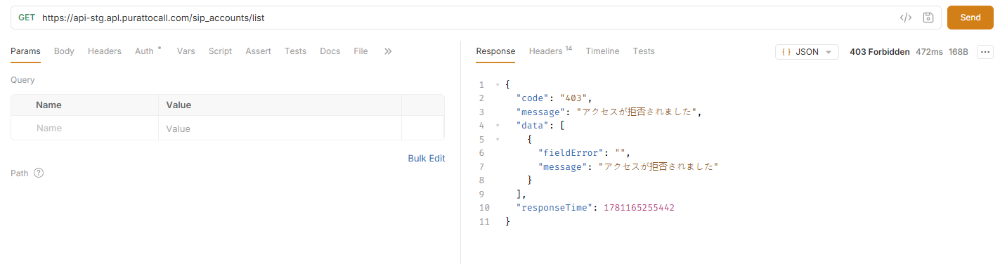
    
    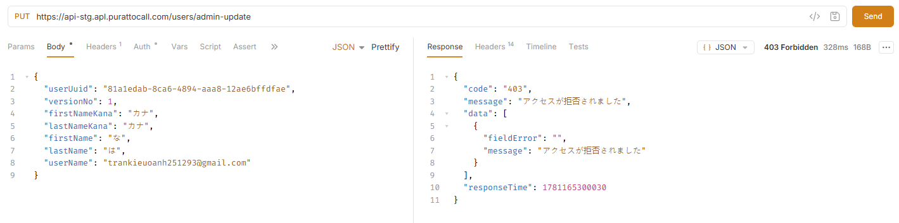
    
    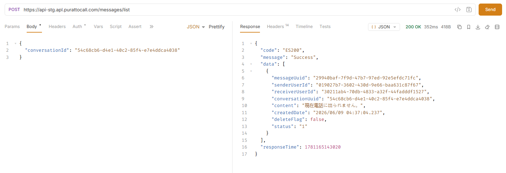
