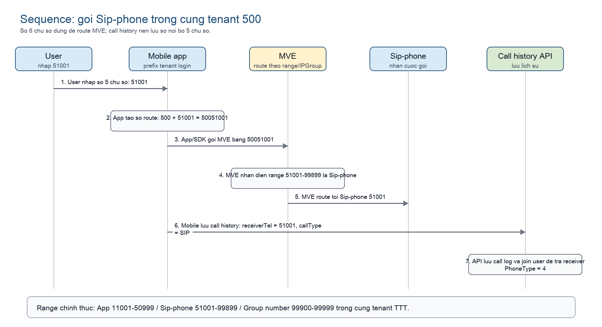

# Spec luồng đối ứng SIP-phone

## 改訂履歴

| 版数 | 改訂日 | 改訂者 | 改訂内容 |
|---|---|---|---|
| 1.0.0 | 2026/07/01 | VTI | 初版作成 |
| 1.1.0 | 2026/07/01 | VTI | Cập nhật spec dùng chung tenant cho App, SIP-phone và Group number |
| 1.2.0 | 2026/07/01 | VTI | Bổ sung phạm vi tenant 111-154 giữ nguyên logic hiện hữu |
| 1.3.0 | 2026/07/01 | VTI | Chỉnh nội dung sang format tài liệu thiết kế chính thức |

## 1. Mục đích

Tài liệu này quy định thiết kế luồng đối ứng SIP-phone cho hệ thống ITEC Denwa.

Thiết kế mới áp dụng cho tenant `500` - `999`. Logic hiện hữu của tenant `111` - `154` giữ nguyên.

## 2. Phạm vi áp dụng

| Dải tenant | Hiện trạng | Phạm vi thay đổi |
|---|---|---|
| `111` - `154` | Dải hiện hữu có logic điện thoại cố định/SV9300 và vẫn có app user | Giữ nguyên, không áp dụng rule SIP-phone mới |
| `500` - `999` | Dải áp dụng đối ứng SIP-phone | Áp dụng rule mới dùng chung tenant cho App, SIP-phone và Group number |

Với tenant `500` - `999`, App, SIP-phone và Group number cùng thuộc một tenant. Ví dụ tenant `500` quản lý cả App, SIP-phone và Group number trong cùng tenant `500`; không tạo tenant riêng `501` cho SIP-phone.

## 3. Thiết kế số nội bộ

User nhập số nội bộ 5 chữ số. Hệ thống dùng số đầy đủ 8 chữ số cho routing MVE theo format:

```text
tenant 3 chữ số + số nội bộ 5 chữ số
```

Ví dụ tenant `500`:

| Loại đích | Số user nhập | Số đầy đủ | Ý nghĩa |
|---|---:|---:|---|
| App | `11001` - `50999` | `50011001` - `50050999` | Gọi user app |
| SIP-phone | `51001` - `99899` | `50051001` - `50099899` | Gọi thiết bị SIP-phone |
| Group number | `99900` - `99999` | `50099900` - `50099999` | Gọi số nhóm nhận cuộc gọi |

`Group number` là số đại diện cho một nhóm nhận cuộc gọi, ví dụ lễ tân hoặc CSKH. Đây không phải số của một user app hoặc một thiết bị SIP-phone riêng lẻ.

DB lưu `userNameSIP` ở dạng số nội bộ 5 chữ số. Số đầy đủ 8 chữ số chỉ dùng cho routing SDK/MVE và export MVE.

## 4. Thiết kế xử lý theo thành phần

### 4.1 Nguyên tắc route

```text
số route = tenant đang login + số 5 chữ số user nhập
```

Ví dụ user login tenant `500`:

| User nhập | App gửi đi |
|---:|---:|
| `11001` | `50011001` |
| `51001` | `50051001` |
| `99901` | `50099901` |

Tenant `111` - `154` tiếp tục sử dụng logic hiện hữu. Tenant `500` - `999` sử dụng rule mới theo `phoneType` và dải số.

| Phần | Thiết kế áp dụng cho tenant `500` - `999` |
|---|---|
| Web validation | Validate `userNameSIP` theo `phoneType` |
| API validation | Dùng cùng rule với Web UI cho đăng ký đơn lẻ và CSV import |
| SIP-phone user | Cho phép `phoneType = 4` trong cùng tenant `500` - `999` |
| Group number | Cho phép `phoneType = 2` với range `99900` - `99999` |
| MVE export | Xuất IPGroup theo loại đích |

### 4.2 Mobile app

Mobile app giữ logic prefix tenant khi gọi bằng dial pad.

Khi user login tenant `500` và nhập `51001`, mobile truyền số route `50051001` cho SDK/MVE. Mobile không tự đổi tenant và không sử dụng tenant `501`.

Call history hiển thị cuộc gọi SIP-phone như một loại đích độc lập. Khi ghi hoặc resolve call history, mobile dùng `receiverTel` dạng 5 chữ số, ví dụ `51001`, hoặc dùng `receiverId`. Không dùng số route 8 chữ số để match trực tiếp với `userNameSIP` trong DB.

### 4.3 Web UI

Web UI validate `userNameSIP` theo `phoneType` cho tenant `500` - `999`. Logic tenant `111` - `154` giữ nguyên.

| phoneType | Label | Range hợp lệ |
|---:|---|---:|
| `1` | スマホの内線番号 | `11001` - `50999` |
| `4` | SIPフォン | `51001` - `99899` |
| `2` | グループ番号 | `99900` - `99999` |

Tooltip và message lỗi hiển thị theo range tương ứng với `phoneType`.

### 4.4 API

API áp dụng rule mới cho tenant `500` - `999`. Logic tenant `111` - `154` giữ nguyên.

| Xử lý | Thiết kế |
|---|---|
| Đăng ký user đơn lẻ | Validate `userNameSIP` theo `phoneType` |
| CSV import | Dùng cùng rule với đăng ký user đơn lẻ |
| SIP-phone | Cho phép `phoneType = 4` nếu số nằm trong `51001` - `99899` |
| Group number | Cho phép `phoneType = 2` nếu số nằm trong `99900` - `99999` |
| Call history | Resolve bằng `receiverTel` 5 chữ số hoặc `receiverId` |

API không sinh tenant `_SIPP` cho tenant `500` - `999`.

### 4.5 MVE/IPGroup export

API export IPGroup theo loại đích.

| phoneType | Range | IPGroup xuất ra |
|---:|---:|---|
| `1` | `11001` - `50999` | `IPG_{tenantName}` |
| `4` | `51001` - `99899` | `IPG_{tenantName}_SIPP` |
| `2` | `99900` - `99999` | `IPG_{tenantName}_GROUP` |

MVE route theo số đầy đủ 8 chữ số và IPGroup được export. Với tenant `500`, các route tương ứng là `50011001` - `50050999`, `50051001` - `50099899`, và `50099900` - `50099999`.

## 5. Sequence

Ví dụ user trong tenant `500` gọi SIP-phone `51001`.



Luồng này không có tenant `501`. MVE phân biệt App, SIP-phone và Group number bằng dải số và IPGroup đã export.

## 6. Điều kiện áp dụng

1. Rule mới chỉ áp dụng cho tenant `500` - `999`.
2. Tenant `111` - `154` giữ nguyên logic điện thoại cố định/SV9300 hiện hữu và vẫn cho phép app user theo thiết kế hiện tại.
3. Tenant `500` - `999` dùng chung một tenant cho App, SIP-phone và Group number.
4. `userNameSIP` trong DB là số nội bộ 5 chữ số.
5. Số đầy đủ 8 chữ số dùng cho route SDK/MVE và export MVE.
6. IPGroup trong export MVE được phân tách theo `phoneType`.
