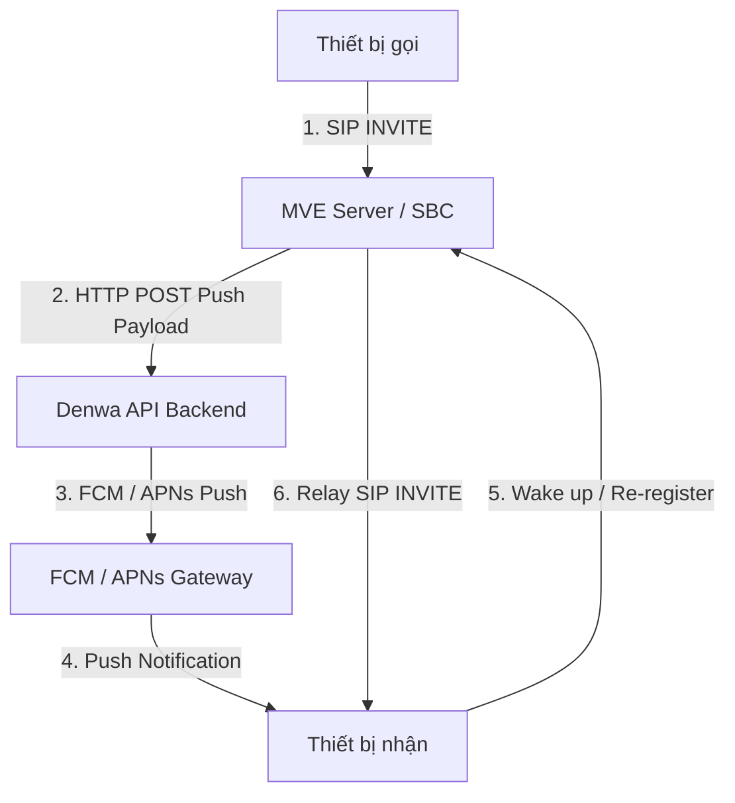
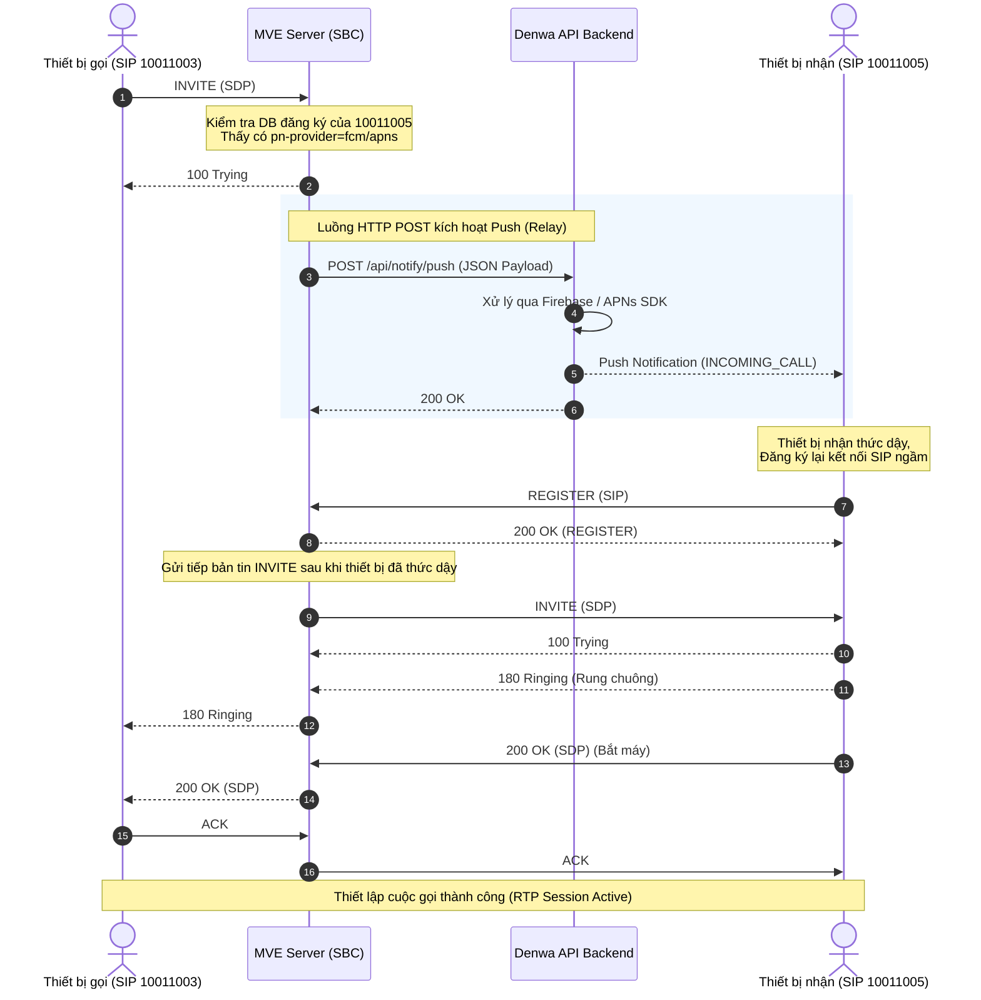

# Kiến trúc Push Notification Relay qua MVE (SBC AudioCodes) và API Backend

Tài liệu này đặc tả kiến trúc, luồng hoạt động tuần tự (Sequence Diagram), cấu trúc payload và các lưu ý kỹ thuật quan trọng khi triển khai tính năng **Thông báo đẩy (Push Notification)** để đánh thức thiết bị di động (Android/iOS) nhận cuộc gọi hoặc thông báo khi ứng dụng bị tắt hoàn toàn (killed) hoặc thiết bị ở chế độ sleep.

---

## 1. Bối cảnh thiết kế & Hạn chế hạ tầng

Quyết định kiến trúc của hệ thống push được xây dựng dựa trên sự phân tách trách nhiệm giữa thiết bị tổng đài phần cứng và máy chủ ứng dụng:

> [!IMPORTANT]
> **Hạn chế kỹ thuật của máy chủ MVE (SBC AudioCodes):**
> Máy chủ MVE đóng vai trò là SBC (Session Border Controller) quản lý các kết nối VoIP/SIP. MVE **không thể** cài đặt SDK quản lý FCM hoặc APNs trực tiếp để tự phát phát push thông báo do giới hạn bản quyền và kiến trúc đóng của AudioCodes.

### Giải pháp kiến trúc (MVE Relay):
- MVE được cấu hình đóng vai trò là **Bộ trung chuyển (Relay)**.
- Khi nhận gói tin SIP (INVITE), MVE sẽ phân tích thông tin đăng ký (Register DB) của tài khoản nhận. Nếu tài khoản có đăng ký các tham số Push trong Contact Header, MVE sẽ thực hiện bắn một cuộc gọi HTTP POST chứa FCM/APNs token đến **API Backend** của hệ thống (Denwa API).
- API Backend (nơi cài đặt Firebase Admin SDK và kết nối APNs) sẽ trực tiếp xử lý và đẩy thông báo qua Firebase Cloud Messaging (FCM) hoặc Apple Push Notification service (APNs).
- Thông báo đẩy này kích hoạt dịch vụ chạy ngầm trên thiết bị di động, tự khởi chạy ứng dụng hoặc đánh thức SIP client để sẵn sàng nhận cuộc gọi SIP INVITE thực tế qua giao thức WebRTC/SIP thông thường.



---

## 2. Luồng hoạt động tuần tự (Sequence Diagram)

Sơ đồ dưới đây mô tả chi tiết quá trình bắt tay và trao đổi thông điệp SIP xen kẽ HTTP POST để thiết lập cuộc gọi khi thiết bị nhận đang tắt ứng dụng (Killed State):



---

## 3. Đặc tả Payload HTTP POST từ MVE về Backend

Khi thực hiện chuyển tiếp sự kiện Push, MVE sẽ gọi API Staging/Production của hệ thống:

- **Endpoint:** `https://<api_domain>/api/notify/push`
- **Method:** `POST`
- **Headers:** `Content-Type: application/x-www-form-urlencoded` hoặc `application/json` (hệ thống API hỗ trợ tiếp nhận cả hai loại định dạng này).

### Cấu trúc JSON Body (Cấu hình chuẩn hóa từ comment #1518295057):
```json
{
    "pn-prid": "cPlGUX1mSnuYI3f0pi9sNp:APA91bEV5wh8ikxgWdHL30EAZJ58I_h1dtcSSxqme7Uxnz9JZk0mwO3ZeQIGEt-HDxHWcQSF69UaQBFvIba7YbiJjIytDoUnCp83F02yZRVtqDo5eABEpj0",
    "caller_sip_displayname": "高橋 奈々",
    "caller_sip_username": "10011005@app-mve.purattocall.com",
    "pn-param": "webrtcclient",
    "pn-provider": "fcm",
    "push_type": "INCOMING_CALL"
}
```

### Ý nghĩa các trường dữ liệu:
| Trường | Kiểu dữ liệu | Ý nghĩa | Ghi chú |
| :--- | :--- | :--- | :--- |
| `pn-prid` | `String` | FCM Registration Token hoặc APNs Device Token | Lấy từ DB của MVE được đăng ký từ Client |
| `caller_sip_displayname` | `String` | Tên hiển thị người gọi | Có thể trống nếu không cấu hình SIP Display Name |
| `caller_sip_username` | `String` | SIP Account của người gọi | Định dạng `<extension>@<domain>` |
| `pn-param` | `String` | Định danh cấu hình Client | Thường là `webrtcclient` hoặc bundle ID của iOS |
| `pn-provider` | `String` | Nhà cung cấp cổng Push | `fcm` (Android) hoặc `apns` (iOS) |
| `push_type` | `String` | Sự kiện kích hoạt Push | Mặc định là `INCOMING_CALL` |

---

## 4. Xử lý Đăng ký Push đầu cuối (SIP REGISTER)

Để MVE ghi nhận chính xác các tham số Push khi gửi POST API, thiết bị di động di động (SIP Client) khi khởi chạy ứng dụng **bắt buộc** phải chèn thêm các tham số Push Notification vào trường **Contact Header** của bản tin **SIP REGISTER**.

### Ví dụ Contact Header trên Android (FCM):
```http
Contact: "User Name" <sip:10011003@192.168.8.19:6000;pn-provider=fcm;pn-param=webrtcclient;pn-prid=APA91bFY7TWc...;ob>
```

### Ví dụ Contact Header trên iOS (APNs):
```http
Contact: "User Name" <sip:10011005@192.168.8.14:7043;pn-provider=apns;pn-param=9K325FD2A2.jp.co.itec.denwa.dev;pn-prid=131920043db3...:voip&e69c69...:remote;ob>
```

> [!WARNING]
> **Gotcha cấu hình trên iOS:**
> Đối với iOS, các tham số token APNs trong `pn-prid` được phân tách bởi ký tự `&` để chỉ định luồng PushKit (`:voip`) và Remote Push thường (`:remote`). Thiết lập này là bắt buộc để iOS có thể nhận dạng đúng loại thông báo VoIP (đánh thức màn hình CallKit hệ thống) hay Remote Notification.

---

## 5. Xử lý lỗi hệ thống & Xung đột giao thức Thoại/Tin nhắn

### 1. Hạn chế dịch vụ Tin nhắn (MESSAGE - Off)
- **Vấn đề phát sinh:** MVE (SBC AudioCodes) không hỗ trợ phân tách hoặc định dạng cấu trúc Push Notification riêng cho tin nhắn chat SIP MESSAGE. Khi bật Push, mọi tin nhắn chat gửi đi cũng kích hoạt POST Push về API Backend tương tự cuộc gọi, nhưng payload gửi về không mang thông tin tin nhắn và đẩy nhầm `push_type: INCOMING_CALL`. Điều này làm thiết bị di động hiển thị thông báo "Cuộc gọi đến" giả khi có tin nhắn chat mới.
- **Giải pháp xử lý:** Tạm thời **vô hiệu hóa chức năng chat nhắn tin (Message-Off)** trên luồng SIP/MVE và chỉ tập trung luồng Push cho dịch vụ thoại (Call). Dịch vụ tin nhắn trong tương lai nên được đồng bộ trực tiếp qua HTTP API của Backend thay thế cho giao thức SIP MESSAGE.

### 2. Các Push Type chính được chuẩn hóa trên Backend:
Phía API Backend cung cấp và phân định rõ 4 loại Push Event để ứng dụng di động nhận diện và phân luồng xử lý:
1. `call push` (Kích hoạt luồng nhận cuộc gọi)
2. `register push` (Đánh thức thiết bị đăng ký lại SIP Session)
3. `message push` (Đồng bộ và hiển thị tin nhắn - sử dụng dự phòng ngoài SIP)
4. `missed call notification` (Thông báo cuộc gọi nhỡ)
